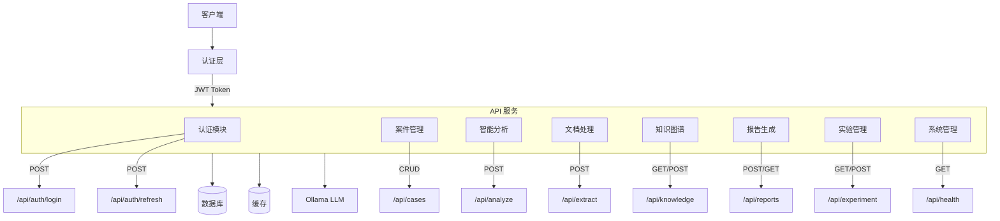
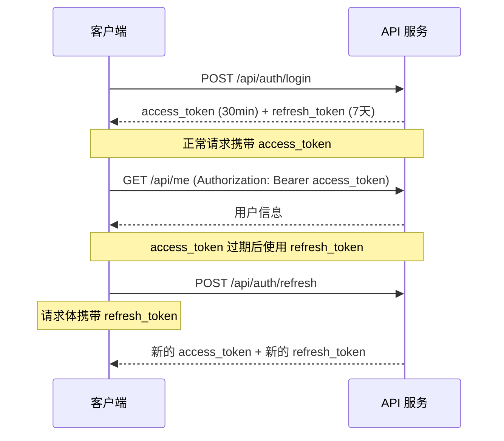

# 帮信罪主观明知分析系统 API 参考文档

## API 概述

本系统提供 RESTful API 接口，支持案件管理、智能分析、知识图谱、实验数据采集和系统管理等功能。所有受保护的端点均需通过 JWT Bearer Token 认证。

## API 架构图



## 通用约定

### 基础 URL

```
http://<host>:<port>/api
```

### 认证方式

所有受保护的端点需要在请求头中携带 JWT Token：

```
Authorization: Bearer <access_token>
```

### 内容类型

- 请求体：`application/json`
- 文件上传：`multipart/form-data`
- 响应体：`application/json`

### 通用响应格式

**成功响应：**

```json
{
  "status": "ok",
  "data": { ... },
  "message": "操作成功"
}
```

**错误响应：**

```json
{
  "detail": "错误描述信息"
}
```

### HTTP 状态码说明

| 状态码 | 含义 | 说明 |
|--------|------|------|
| 200 | OK | 请求成功 |
| 201 | Created | 资源创建成功 |
| 400 | Bad Request | 请求参数错误 |
| 401 | Unauthorized | 未认证或 Token 无效 |
| 403 | Forbidden | 权限不足 |
| 404 | Not Found | 资源不存在 |
| 409 | Conflict | 资源冲突（如用户名已存在） |
| 413 | Payload Too Large | 文件过大 |
| 422 | Unprocessable Entity | 请求体校验失败 |
| 500 | Internal Server Error | 服务器内部错误 |

---

## 1. 认证接口

### 1.1 用户登录

```
POST /api/auth/login
```

**请求头：** 无（公开接口）

**请求体：**

| 参数名 | 类型 | 必填 | 约束 | 说明 |
|--------|------|------|------|------|
| username | string | 是 | 最大长度 100 | 用户名 |
| password | string | 是 | 最大长度 100 | 密码 |

**请求示例：**

```json
{
  "username": "admin",
  "password": "admin123"
}
```

**响应状态码：** 200 / 401 / 403

**成功响应：**

```json
{
  "access_token": "eyJhbGciOiJIUzI1NiIs...",
  "refresh_token": "eyJhbGciOiJIUzI1NiIs...",
  "token_type": "bearer"
}
```

**错误响应：**

```json
{
  "detail": "用户名或密码错误"
}
```

```json
{
  "detail": "用户账户已被禁用"
}
```

### 1.2 刷新 Token

```
POST /api/auth/refresh
```

**请求头：** 无（公开接口）

**请求体：**

| 参数名 | 类型 | 必填 | 约束 | 说明 |
|--------|------|------|------|------|
| refresh_token | string | 是 | - | 有效的刷新令牌 |

**请求示例：**

```json
{
  "refresh_token": "eyJhbGciOiJIUzI1NiIs..."
}
```

**响应状态码：** 200 / 401

**成功响应：**

```json
{
  "access_token": "eyJhbGciOiJIUzI1NiIs...",
  "refresh_token": "eyJhbGciOiJIUzI1NiIs...",
  "token_type": "bearer"
}
```

**错误响应：**

```json
{
  "detail": "无效的刷新令牌"
}
```

---

## 2. 系统接口

### 2.1 健康检查

```
GET /api/health
```

**请求头：** 无（公开接口）

**请求参数：** 无

**响应状态码：** 200

**成功响应：**

```json
{
  "status": "ok",
  "ollama": "connected",
  "database": "connected",
  "timestamp": "2026-05-24T10:30:00.123456+00:00"
}
```

**降级响应（依赖服务故障时）：**

```json
{
  "status": "degraded",
  "ollama": "error: ConnectError(Connection refused)",
  "database": "connected",
  "timestamp": "2026-05-24T10:30:00.123456+00:00"
}
```

### 2.2 获取当前用户信息

```
GET /api/me
```

**请求头：**

| 头信息 | 必填 | 说明 |
|--------|------|------|
| Authorization | 是 | Bearer Token |

**请求参数：** 无

**响应状态码：** 200 / 401

**成功响应：**

```json
{
  "id": 1,
  "username": "admin",
  "role": "admin",
  "is_active": true,
  "created_at": "2026-05-24T10:00:00+00:00"
}
```

### 2.3 获取缓存统计

```
GET /api/cache/stats
```

**请求头：**

| 头信息 | 必填 | 说明 |
|--------|------|------|
| Authorization | 是 | Bearer Token |

**请求参数：** 无

**响应状态码：** 200 / 401

**成功响应：**

```json
{
  "cache": {
    "hits": 42,
    "misses": 15,
    "size": 128,
    "maxsize": 1024
  }
}
```

### 2.4 清除缓存

```
POST /api/cache/clear
```

**请求头：**

| 头信息 | 必填 | 说明 |
|--------|------|------|
| Authorization | 是 | Bearer Token |

**请求参数：** 无

**响应状态码：** 200 / 401

**成功响应：**

```json
{
  "status": "ok",
  "entries_removed": 128
}
```

### 2.5 获取模型版本

```
GET /api/model-version
```

**请求头：**

| 头信息 | 必填 | 说明 |
|--------|------|------|
| Authorization | 是 | Bearer Token |

**请求参数：** 无

**响应状态码：** 200 / 401

**成功响应：**

```json
{
  "model_name": "qwen2.5:7b",
  "version": "1.0.0",
  "fine_tune_time": "2026-05-01T08:00:00+00:00",
  "metrics": {
    "accuracy": 0.923,
    "precision": 0.915,
    "recall": 0.908,
    "f1_score": 0.911
  },
  "notes": "v2.0 主干模型微调版本，针对帮信罪分析优化"
}
```

**默认响应（无版本记录时）：**

```json
{
  "model_name": "qwen2.5:7b",
  "version": "1.0.0",
  "fine_tune_time": null,
  "metrics": {
    "accuracy": 0.0,
    "precision": 0.0,
    "recall": 0.0,
    "f1_score": 0.0
  },
  "notes": "初始版本"
}
```

### 2.6 获取系统日志

```
GET /api/logs
```

**请求头：**

| 头信息 | 必填 | 说明 |
|--------|------|------|
| Authorization | 是 | Bearer Token |

**查询参数：**

| 参数名 | 类型 | 必填 | 默认值 | 约束 | 说明 |
|--------|------|------|--------|------|------|
| page | integer | 否 | 1 | >= 1 | 页码 |
| page_size | integer | 否 | 20 | 1-200 | 每页数量 |
| log_level | string | 否 | - | 任意 | 日志级别筛选（INFO、WARNING、ERROR 等） |
| search | string | 否 | - | 任意 | 搜索关键词（匹配 action、message、username） |

**响应状态码：** 200 / 401

**成功响应：**

```json
{
  "items": [
    {
      "id": 1,
      "log_level": "INFO",
      "username": "admin",
      "action": "用户登录",
      "message": "用户 admin 登录成功",
      "ip_address": "192.168.1.100",
      "created_at": "2026-05-24T10:30:00+00:00"
    }
  ],
  "total": 156,
  "page": 1,
  "page_size": 20
}
```

---

## 3. 案件管理接口

### 3.1 创建案件

```
POST /api/cases
```

**请求头：**

| 头信息 | 必填 | 说明 |
|--------|------|------|
| Authorization | 是 | Bearer Token |

**请求体：**

| 参数名 | 类型 | 必填 | 约束 | 说明 |
|--------|------|------|------|------|
| title | string | 是 | 1-255 字符 | 案件标题 |
| case_text | string | 是 | 10-50000 字符 | 案件事实文本 |
| description | string | 否 | 任意 | 案件描述 |

**请求示例：**

```json
{
  "title": "张三涉嫌帮信罪案",
  "case_text": "2024年3月，被告人张三明知他人利用信息网络实施犯罪，仍将自己的2张银行卡提供给对方使用，流水金额共计50万元...",
  "description": "典型帮信罪案例，涉及银行卡出借"
}
```

**响应状态码：** 201 / 401 / 422

**成功响应：**

```json
{
  "id": 1,
  "title": "张三涉嫌帮信罪案",
  "description": "典型帮信罪案例，涉及银行卡出借",
  "case_text": "2024年3月，被告人张三明知他人利用信息网络实施犯罪...",
  "status": "pending",
  "created_at": "2026-05-24T10:30:00",
  "updated_at": "2026-05-24T10:30:00"
}
```

### 3.2 获取案件列表

```
GET /api/cases
```

**请求头：**

| 头信息 | 必填 | 说明 |
|--------|------|------|
| Authorization | 是 | Bearer Token |

**查询参数：**

| 参数名 | 类型 | 必填 | 默认值 | 约束 | 说明 |
|--------|------|------|--------|------|------|
| skip | integer | 否 | 0 | >= 0 | 跳过的记录数 |
| limit | integer | 否 | 20 | 1-100 | 返回条数 |
| status | string | 否 | - | 任意 | 按状态筛选（pending、analyzed 等） |

**响应状态码：** 200 / 401

**成功响应：**

```json
{
  "total": 42,
  "items": [
    {
      "id": 1,
      "title": "张三涉嫌帮信罪案",
      "description": "典型帮信罪案例，涉及银行卡出借",
      "case_text": "2024年3月，被告人张三明知他人利用信息网络实施犯罪...",
      "status": "pending",
      "created_at": "2026-05-24T10:30:00",
      "updated_at": "2026-05-24T10:30:00"
    }
  ],
  "skip": 0,
  "limit": 20
}
```

### 3.3 获取单个案件

```
GET /api/cases/{case_id}
```

**请求头：**

| 头信息 | 必填 | 说明 |
|--------|------|------|
| Authorization | 是 | Bearer Token |

**路径参数：**

| 参数名 | 类型 | 必填 | 说明 |
|--------|------|------|------|
| case_id | integer | 是 | 案件 ID |

**响应状态码：** 200 / 401 / 404

**成功响应：**

```json
{
  "id": 1,
  "title": "张三涉嫌帮信罪案",
  "description": "典型帮信罪案例，涉及银行卡出借",
  "case_text": "2024年3月，被告人张三明知他人利用信息网络实施犯罪...",
  "status": "pending",
  "created_at": "2026-05-24T10:30:00",
  "updated_at": "2026-05-24T10:30:00"
}
```

**错误响应：**

```json
{
  "detail": "Case not found"
}
```

### 3.4 删除案件

```
DELETE /api/cases/{case_id}
```

**请求头：**

| 头信息 | 必填 | 说明 |
|--------|------|------|
| Authorization | 是 | Bearer Token |

**路径参数：**

| 参数名 | 类型 | 必填 | 说明 |
|--------|------|------|------|
| case_id | integer | 是 | 案件 ID |

**响应状态码：** 200 / 401 / 404

**成功响应：**

```json
{
  "message": "Case deleted successfully"
}
```

**错误响应：**

```json
{
  "detail": "Case not found"
}
```

---

## 4. 智能分析接口

### 4.1 分析案件

```
POST /api/analyze
```

**请求头：**

| 头信息 | 必填 | 说明 |
|--------|------|------|
| Authorization | 是 | Bearer Token |

**请求体：**

| 参数名 | 类型 | 必填 | 约束 | 说明 |
|--------|------|------|------|------|
| case_text | string | 是 | 10-50000 字符 | 待分析的案件事实文本 |
| mode | string | 否 | 枚举：auto / single / pipeline | 分析模式，默认 auto |

**请求示例：**

```json
{
  "case_text": "2024年3月，被告人张三明知他人利用信息网络实施犯罪，仍将自己的2张银行卡提供给对方使用，流水金额共计50万元...",
  "mode": "auto"
}
```

**响应状态码：** 200 / 401 / 422

**成功响应：**

```json
{
  "behavior_assessment": {
    "anomaly_score": 0.87,
    "suspicious_actions": ["频繁转账", "多卡使用"],
    "pattern_match": "典型帮信行为模式",
    "analysis": "被告人在短期内集中办理多张银行卡并出借，不符合正常使用习惯"
  },
  "cognitive_assessment": {
    "knowledge_level": "应当明知",
    "confidence": 0.92,
    "reasoning": "被告人曾签署不参与网络诈骗承诺书，且对方承诺给予明显高于正常水平的报酬",
    "matching_rules": ["推定明知-报酬异常"]
  },
  "defense_assessment": {
    "defense_type": "不知情抗辩",
    "rationality": "低",
    "analysis": "被告人的辩解与在案证据矛盾，其收取异常报酬的行为不符合正常出借银行卡的解释",
    "counter_arguments": ["报酬金额异常", "多卡同时出借"]
  },
  "overall_summary": "综合分析，被告人主观上对帮助信息网络犯罪活动罪的主观明知要件高度吻合，三维权度分析结果一致指向明知认定。",
  "evidence_refs": [
    "银行卡开户记录",
    "银行交易流水",
    "被告人供述",
    "同案犯供述"
  ],
  "knowledge_score": 0.89
}
```

### 4.2 获取分析历史列表

```
GET /api/analyses
```

**请求头：**

| 头信息 | 必填 | 说明 |
|--------|------|------|
| Authorization | 是 | Bearer Token |

**查询参数：**

| 参数名 | 类型 | 必填 | 默认值 | 约束 | 说明 |
|--------|------|------|--------|------|------|
| skip | integer | 否 | 0 | >= 0 | 跳过的记录数 |
| limit | integer | 否 | 20 | >= 1 | 返回条数 |

**响应状态码：** 200 / 401

**成功响应：**

```json
[
  {
    "id": 1,
    "case_id": 1,
    "knowledge_score": 0.89,
    "mode": "auto",
    "created_at": "2026-05-24T10:30:00"
  },
  {
    "id": 2,
    "case_id": 2,
    "knowledge_score": 0.76,
    "mode": "pipeline",
    "created_at": "2026-05-24T10:35:00"
  }
]
```

### 4.3 获取分析详情

```
GET /api/analyses/{analysis_id}
```

**请求头：**

| 头信息 | 必填 | 说明 |
|--------|------|------|
| Authorization | 是 | Bearer Token |

**路径参数：**

| 参数名 | 类型 | 必填 | 说明 |
|--------|------|------|------|
| analysis_id | integer | 是 | 分析记录 ID |

**响应状态码：** 200 / 401 / 404

**成功响应：**

```json
{
  "id": 1,
  "case_id": 1,
  "result": {
    "behavior_assessment": { ... },
    "cognitive_assessment": { ... },
    "defense_assessment": { ... },
    "overall_summary": "综合分析结果...",
    "evidence_refs": ["银行卡开户记录"],
    "knowledge_score": 0.89
  },
  "knowledge_score": 0.89,
  "mode": "auto",
  "created_at": "2026-05-24T10:30:00"
}
```

**错误响应：**

```json
{
  "detail": "Analysis not found"
}
```

---

## 5. 文档处理接口

### 5.1 文档文本提取

```
POST /api/extract
```

**请求头：**

| 头信息 | 必填 | 说明 |
|--------|------|------|
| Authorization | 否 | 公开接口 |

**请求体：** `multipart/form-data`

| 参数名 | 类型 | 必填 | 约束 | 说明 |
|--------|------|------|------|------|
| file | File | 是 | 最大 20MB | 上传文件，支持 PDF、DOCX、DOC 格式 |

**支持格式：** `.pdf` `.docx` `.doc`

**响应状态码：** 200 / 400 / 413 / 422

**成功响应：**

```json
{
  "filename": "起诉书.pdf",
  "text": "被告人张三...（提取的文本内容）",
  "method": "pdf_ocr",
  "length": 15820,
  "paragraphs": 45
}
```

**错误响应：**

```json
{
  "detail": "Unsupported file format '.png'. Allowed: .pdf, .docx, .doc"
}
```

```json
{
  "detail": "File too large. Maximum size is 20MB"
}
```

### 5.2 实体提取

```
POST /api/extract_entities
```

**请求头：**

| 头信息 | 必填 | 说明 |
|--------|------|------|
| Authorization | 否 | 公开接口 |

**请求体：**

| 参数名 | 类型 | 必填 | 约束 | 说明 |
|--------|------|------|------|------|
| text | string | 是 | 10-50000 字符 | 待提取实体的案件事实文本 |

**请求示例：**

```json
{
  "text": "2024年3月，被告人张三通过微信联系上线李四，使用其名下中国银行卡（尾号1234）接收并转移诈骗资金共计人民币50万元。"
}
```

**响应状态码：** 200 / 422 / 500

**成功响应：**

```json
{
  "entities": {
    "people": [
      { "type": "人物", "value": "张三", "confidence": 0.98 },
      { "type": "人物", "value": "李四", "confidence": 0.95 }
    ],
    "financial": [
      { "type": "银行卡", "value": "中国银行卡（尾号1234）", "confidence": 0.97 },
      { "type": "金额", "value": "50万元", "confidence": 0.99 }
    ],
    "communication": [
      { "type": "通讯工具", "value": "微信", "confidence": 0.99 }
    ],
    "transaction": [
      { "type": "交易平台", "value": "银行转账", "confidence": 0.85 }
    ]
  },
  "relations": [
    {
      "subject": "张三",
      "relation": "使用",
      "object": "中国银行卡（尾号1234）",
      "confidence": 0.93
    },
    {
      "subject": "张三",
      "relation": "联系",
      "object": "李四",
      "confidence": 0.91
    }
  ],
  "entity_count": 6,
  "relation_count": 2
}
```

---

## 6. 知识图谱接口

### 6.1 获取知识图谱

```
GET /api/knowledge/graph
```

**请求头：** 无（公开接口）

**请求参数：** 无

**响应状态码：** 200 / 500

**成功响应：**

```json
{
  "success": true,
  "data": {
    "nodes": [
      { "id": "feature_001", "label": "多卡使用", "type": "feature", "group": "behavior" },
      { "id": "rule_001", "label": "推定明知规则", "type": "rule", "group": "reasoning" },
      { "id": "case_001", "label": "张三案", "type": "case", "group": "case" }
    ],
    "edges": [
      { "source": "case_001", "target": "feature_001", "relation": "存在特征" },
      { "source": "feature_001", "target": "rule_001", "relation": "触发规则" }
    ],
    "metadata": {
      "node_count": 120,
      "edge_count": 350,
      "layers": ["feature_graph", "reasoning_graph", "case_graph"]
    }
  }
}
```

**错误响应：**

```json
{
  "detail": "获取知识图谱失败: (错误详情)"
}
```

### 6.2 规则匹配

```
POST /api/knowledge/match-rules
```

**请求头：** 无（公开接口）

**请求体：**

| 参数名 | 类型 | 必填 | 约束 | 说明 |
|--------|------|------|------|------|
| evidence_type | string | 是 | 非空 | 证据类型名称 |

**请求示例：**

```json
{
  "evidence_type": "银行卡交易流水"
}
```

**响应状态码：** 200 / 400 / 500

**成功响应：**

```json
{
  "success": true,
  "data": {
    "rules": [
      {
        "rule_id": "rule_001",
        "name": "交易流水异常推定明知",
        "source_law": "刑法",
        "article": "第二百八十七条之二",
        "score": 0.92,
        "features": ["频繁交易", "多账户交易", "夜间交易"]
      }
    ],
    "matched_features": ["频繁交易", "多账户交易"]
  }
}
```

**错误响应：**

```json
{
  "detail": "证据类型不能为空"
}
```

### 6.3 相似案例检索

```
POST /api/knowledge/similar-cases
```

**请求头：** 无（公开接口）

**请求体：**

| 参数名 | 类型 | 必填 | 约束 | 说明 |
|--------|------|------|------|------|
| case_features | string[] | 是 | 非空数组 | 案件特征列表 |
| top_k | integer | 否 | 1-50，默认 5 | 返回结果数量 |

**请求示例：**

```json
{
  "case_features": ["多卡使用", "异常报酬", "频繁转账"],
  "top_k": 5
}
```

**响应状态码：** 200 / 400 / 500

**成功响应：**

```json
{
  "success": true,
  "data": [
    {
      "case_id": "case_001",
      "title": "张三涉嫌帮信罪案",
      "similarity": 0.89,
      "matched_features": ["多卡使用", "异常报酬"],
      "verdict": "定罪"
    }
  ]
}
```

**错误响应：**

```json
{
  "detail": "案件特征列表不能为空"
}
```

```json
{
  "detail": "top_k 必须在 1-50 之间"
}
```

### 6.4 推理路径追溯

```
POST /api/knowledge/trace-reasoning
```

**请求头：** 无（公开接口）

**请求体：**

| 参数名 | 类型 | 必填 | 约束 | 说明 |
|--------|------|------|------|------|
| conclusion | string | 是 | 非空 | 结论类型（如"明知"、"不明知"） |

**请求示例：**

```json
{
  "conclusion": "主观明知"
}
```

**响应状态码：** 200 / 400 / 500

**成功响应：**

```json
{
  "success": true,
  "data": {
    "paths": [
      {
        "path": ["行为特征", "交易流水异常", "异常报酬"],
        "steps": [
          { "order": 1, "description": "识别多卡使用行为", "rule": "行为模式识别" },
          { "order": 2, "description": "匹配异常交易规则", "rule": "交易异常推定" },
          { "order": 3, "description": "综合评定主观明知", "rule": "综合认定规则" }
        ],
        "confidence": 0.89,
        "evidence": ["银行卡流水", "工资水平证明"]
      }
    ]
  }
}
```

**错误响应：**

```json
{
  "detail": "结论类型不能为空"
}
```

---

## 7. 报告接口

### 7.1 搜索相似案例

```
POST /api/reports/similar-cases
```

**请求头：** 无（公开接口）

**请求体：**

| 参数名 | 类型 | 必填 | 约束 | 说明 |
|--------|------|------|------|------|
| case_text | string | 是 | 非空 | 案件事实文本 |
| top_k | integer | 否 | 1-20，默认 5 | 返回结果数量 |

**请求示例：**

```json
{
  "case_text": "2024年3月，被告人张三明知他人利用信息网络实施犯罪，仍将自己的2张银行卡提供给对方使用...",
  "top_k": 5
}
```

**响应状态码：** 200 / 400 / 500

**成功响应：**

```json
{
  "success": true,
  "data": [
    {
      "case_id": "ref_001",
      "title": "李四帮信罪案",
      "similarity_score": 0.87,
      "facts_summary": "被告人出借3张银行卡，获利5000元",
      "verdict": "定罪",
      "sentence": "有期徒刑8个月",
      "key_points": ["多卡出借", "获利目的"]
    }
  ],
  "total": 5
}
```

**错误响应：**

```json
{
  "detail": "案件文本不能为空"
}
```

```json
{
  "detail": "top_k 必须在 1-20 之间"
}
```

### 7.2 获取相似案例详情

```
GET /api/reports/similar-cases/{case_id}
```

**请求头：** 无（公开接口）

**路径参数：**

| 参数名 | 类型 | 必填 | 说明 |
|--------|------|------|------|
| case_id | string | 是 | 参考案例 ID |

**响应状态码：** 200 / 404

**成功响应：**

```json
{
  "success": true,
  "data": {
    "case_id": "ref_001",
    "title": "李四帮信罪案",
    "court": "北京市海淀区人民法院",
    "case_number": "(2024)京0108刑初XXX号",
    "facts": "2024年1月，被告人李四明知他人利用信息网络实施犯罪...",
    "verdict": "帮助信息网络犯罪活动罪",
    "sentence": "有期徒刑8个月，缓刑1年，并处罚金人民币5000元",
    "reasoning": "法院认为，被告人李四明知他人利用信息网络实施犯罪...",
    "evidence_list": ["银行卡交易流水", "微信聊天记录", "被告人供述"]
  }
}
```

**错误响应：**

```json
{
  "detail": "未找到案例: ref_001"
}
```

### 7.3 生成量刑建议

```
POST /api/reports/sentencing
```

**请求头：** 无（公开接口）

**请求体：**

| 参数名 | 类型 | 必填 | 约束 | 说明 |
|--------|------|------|------|------|
| case_text | string | 是 | 非空 | 案件事实文本 |
| top_k | integer | 否 | 1-20，默认 5 | 参考案例数量 |

**请求示例：**

```json
{
  "case_text": "2024年3月，被告人张三明知他人利用信息网络实施犯罪，仍将自己的2张银行卡提供给对方使用...",
  "top_k": 5
}
```

**响应状态码：** 200 / 400 / 500

**成功响应：**

```json
{
  "success": true,
  "data": {
    "recommended_sentence": "有期徒刑6-8个月",
    "recommended_fine": "人民币5000-10000元",
    "basis": "根据相似案例统计分析，涉案金额50万元，出借2张银行卡...",
    "mitigating_factors": ["认罪认罚", "初犯", "退赃退赔"],
    "aggravating_factors": ["多卡出借", "持续时间长"],
    "similar_cases_count": 12,
    "confidence": 0.85
  }
}
```

### 7.4 获取量刑详情

```
GET /api/reports/sentencing/{case_id}
```

**请求头：** 无（公开接口）

**路径参数：**

| 参数名 | 类型 | 必填 | 说明 |
|--------|------|------|------|
| case_id | string | 是 | 参考案例 ID |

**响应状态码：** 200 / 404

**成功响应：**

```json
{
  "success": true,
  "data": {
    "case_id": "ref_001",
    "title": "李四帮信罪案",
    "sentence_details": {
      "main_sentence": "有期徒刑8个月",
      "suspension": "缓刑1年",
      "fine": "人民币5000元",
      "confiscation": "无"
    },
    "sentencing_basis": {
      "law": "刑法第二百八十七条之二",
      "guidelines": "最高人民法院量刑指导意见",
      "amount_range": "20-50万元"
    }
  }
}
```

**错误响应：**

```json
{
  "detail": "未找到案例: ref_001"
}
```

### 7.5 证据溯源

```
POST /api/reports/evidence-trace
```

**请求头：** 无（公开接口）

**请求体：**

| 参数名 | 类型 | 必填 | 约束 | 说明 |
|--------|------|------|------|------|
| case_text | string | 是 | 非空 | 案件原文 |
| evidence_text | string | 是 | 非空 | 证据片段，用于在原文中定位 |

**请求示例：**

```json
{
  "case_text": "2024年3月，被告人张三明知他人利用信息网络实施犯罪，仍将自己的2张银行卡提供给对方使用。对方承诺每月给予5000元报酬。经查，被告人名下中国银行卡（尾号1234）在此期间流水金额共计50万元。",
  "evidence_text": "被告人名下中国银行卡（尾号1234）在此期间流水金额共计50万元"
}
```

**响应状态码：** 200 / 400 / 404

**成功响应：**

```json
{
  "success": true,
  "data": {
    "before_text": "人利用信息网络实施犯罪，仍将自己的2张银行卡提供给对方使用。对方承诺每月给予5000元报酬。经查，",
    "matched_text": "被告人名下中国银行卡（尾号1234）在此期间流水金额共计50万元",
    "after_text": "。",
    "start_pos": 62,
    "end_pos": 123,
    "full_context": "2024年3月，被告人张三明知他人利用信息网络实施犯罪，仍将自己的2张银行卡提供给对方使用。对方承诺每月给予5000元报酬。经查，被告人名下中国银行卡（尾号1234）在此期间流水金额共计50万元。"
  }
}
```

**错误响应：**

```json
{
  "detail": "证据文本不能为空"
}
```

```json
{
  "detail": "未找到匹配的证据原文"
}
```

---

## 8. 实验管理接口

### 8.1 分配实验案例

```
GET /api/experiment/assign-case
```

**请求头：**

| 头信息 | 必填 | 说明 |
|--------|------|------|
| Authorization | 是 | Bearer Token |

**请求参数：** 无

**响应状态码：** 200 / 400 / 401

**成功响应：**

```json
{
  "assignment": {
    "assignment_id": "assign_001",
    "case_id": "case_exp_005",
    "group": "A",
    "assigned_at": "2026-05-24T10:30:00"
  },
  "case": {
    "case_id": "case_exp_005",
    "title": "实验案例五",
    "facts": "2025年1月，被告人王五在微信群中看到招聘信息..."
  },
  "ai_report": {
    "summary": "系统分析报告内容（仅 B 组用户可见）",
    "knowledge_score": 0.85
  }
}
```

> **注意：** `ai_report` 字段仅在实验 B 组用户返回，A 组用户不包含此字段。

**错误响应：**

```json
{
  "detail": "所有案例已完成，暂无可分配案例"
}
```

### 8.2 提交实验判断

```
POST /api/experiment/submit-judgment
```

**请求头：**

| 头信息 | 必填 | 说明 |
|--------|------|------|
| Authorization | 是 | Bearer Token |

**请求体：**

| 参数名 | 类型 | 必填 | 约束 | 说明 |
|--------|------|------|------|------|
| case_id | string | 是 | 1-50 字符 | 案例 ID |
| subjective_knowledge | boolean | 是 | - | 是否认定主观明知 |
| confidence_score | integer | 是 | 1-100 | 信心评分 |
| reasoning_text | string | 是 | 10-10000 字符 | 推理过程说明 |
| reaction_time_ms | integer | 是 | >= 0 | 反应时间（毫秒） |
| ai_adoption | object | 否 | - | AI 建议采纳情况（仅 B 组） |

**ai_adoption 对象：**

| 参数名 | 类型 | 必填 | 约束 | 说明 |
|--------|------|------|------|------|
| status | string | 是 | 枚举：fully_adopted / partially_adopted / not_adopted | 采纳状态 |
| reason | string | 否 | 最大 5000 字符 | 采纳/不采纳理由 |

**请求示例（A 组）：**

```json
{
  "case_id": "case_exp_005",
  "subjective_knowledge": true,
  "confidence_score": 85,
  "reasoning_text": "被告人出借多张银行卡且收取异常报酬，应当认定为明知",
  "reaction_time_ms": 45000
}
```

**请求示例（B 组，含 AI 采纳）：**

```json
{
  "case_id": "case_exp_005",
  "subjective_knowledge": true,
  "confidence_score": 90,
  "reasoning_text": "同意系统分析结果，被告人行为符合帮信罪主观明知要件",
  "reaction_time_ms": 30000,
  "ai_adoption": {
    "status": "fully_adopted",
    "reason": "系统分析全面准确，与本人判断一致"
  }
}
```

**响应状态码：** 200 / 400 / 401 / 422

**成功响应：**

```json
{
  "status": "ok",
  "message": "判断已成功提交",
  "record": {
    "record_id": "judge_001",
    "case_id": "case_exp_005",
    "subjective_knowledge": true,
    "confidence_score": 85,
    "created_at": "2026-05-24T10:30:00"
  }
}
```

### 8.3 获取实验进度

```
GET /api/experiment/progress
```

**请求头：**

| 头信息 | 必填 | 说明 |
|--------|------|------|
| Authorization | 是 | Bearer Token |

**请求参数：** 无

**响应状态码：** 200 / 401

**成功响应：**

```json
{
  "username": "experimenter_01",
  "group": "A",
  "total": 20,
  "completed": 8,
  "pending": 12,
  "has_started": true
}
```

### 8.4 获取实验统计

```
GET /api/experiment/stats
```

**请求头：**

| 头信息 | 必填 | 说明 |
|--------|------|------|
| Authorization | 是 | Bearer Token |

**请求参数：** 无

**响应状态码：** 200 / 401

**成功响应：**

```json
{
  "total_users": 30,
  "total_assignments": 300,
  "total_completed": 180,
  "completion_rate": 0.6,
  "group_stats": {
    "A": {
      "user_count": 15,
      "completed": 95,
      "completion_rate": 0.63
    },
    "B": {
      "user_count": 15,
      "completed": 85,
      "completion_rate": 0.57
    }
  },
  "average_stats": {
    "avg_reaction_time_ms": 35000,
    "avg_confidence_score": 78.5,
    "knowledge_positive_rate": 0.72
  }
}
```

### 8.5 导出实验数据

```
GET /api/experiment/export
```

**请求头：**

| 头信息 | 必填 | 说明 |
|--------|------|------|
| Authorization | 是 | Bearer Token，且需 admin 角色 |

**请求参数：** 无

**响应状态码：** 200 / 401 / 403

**成功响应：**

```json
{
  "export_time": "2026-05-24T10:30:00",
  "data": {
    "assignments": [
      {
        "assignment_id": "assign_001",
        "username": "experimenter_01",
        "case_id": "case_exp_005",
        "group": "A",
        "assigned_at": "2026-05-24T09:00:00"
      }
    ],
    "judgments": [
      {
        "record_id": "judge_001",
        "username": "experimenter_01",
        "case_id": "case_exp_005",
        "subjective_knowledge": true,
        "confidence_score": 85,
        "reaction_time_ms": 45000,
        "ai_adoption": null,
        "created_at": "2026-05-24T10:30:00"
      }
    ],
    "progress": {
      "total_users": 30,
      "completion_rate": 0.6
    },
    "stats": { ... }
  }
}
```

**错误响应：**

```json
{
  "detail": "仅管理员可导出实验数据"
}
```

---

## 9. 法律规则管理接口

### 9.1 获取规则列表

```
GET /api/rules
```

**请求头：**

| 头信息 | 必填 | 说明 |
|--------|------|------|
| Authorization | 是 | Bearer Token |

**查询参数：**

| 参数名 | 类型 | 必填 | 默认值 | 约束 | 说明 |
|--------|------|------|--------|------|------|
| page | integer | 否 | 1 | >= 1 | 页码 |
| page_size | integer | 否 | 10 | 1-100 | 每页数量 |
| search | string | 否 | - | 任意 | 搜索关键词（匹配 name、rule_id、description） |

**响应状态码：** 200 / 401

**成功响应：**

```json
{
  "items": [
    {
      "id": 1,
      "rule_id": "rule_001",
      "name": "推定明知规则-报酬异常",
      "description": "当被告人收取明显异常报酬时，可推定其主观明知",
      "source_law": "刑法",
      "article": "第二百八十七条之二",
      "conditions": [
        "报酬金额明显高于正常市场水平",
        "报酬与提供帮助之间无合理对价关系"
      ],
      "conclusion": "可推定主观明知",
      "evidence_types": [
        "微信聊天记录",
        "转账记录",
        "证人证言"
      ],
      "weight": 0.9,
      "created_at": "2026-05-01T08:00:00",
      "updated_at": "2026-05-01T08:00:00"
    }
  ],
  "total": 25,
  "page": 1,
  "page_size": 10
}
```

### 9.2 创建规则

```
POST /api/rules
```

**请求头：**

| 头信息 | 必填 | 说明 |
|--------|------|------|
| Authorization | 是 | Bearer Token，需 admin 角色 |

**请求体：**

| 参数名 | 类型 | 必填 | 约束 | 说明 |
|--------|------|------|------|------|
| rule_id | string | 是 | 1-50 字符 | 规则唯一标识 |
| name | string | 是 | 1-200 字符 | 规则名称 |
| description | string | 否 | 任意 | 规则描述 |
| source_law | string | 否 | 任意 | 来源法律 |
| article | string | 否 | 任意 | 法条编号 |
| conditions | string | 否 | 任意 | 条件（以 | 分隔） |
| conclusion | string | 否 | 任意 | 结论 |
| evidence_types | string | 否 | 任意 | 证据类型（以 | 分隔） |
| weight | float | 否 | 默认 1.0 | 权重 |

**请求示例：**

```json
{
  "rule_id": "rule_002",
  "name": "多卡出借推定规则",
  "description": "以出租、出借多张银行卡的方式帮助信息网络犯罪的推定规则",
  "source_law": "刑法",
  "article": "第二百八十七条之二",
  "conditions": "出借银行卡数量>=3张|流水金额>20万元",
  "conclusion": "可推定主观明知",
  "evidence_types": "银行卡开户记录|银行交易流水",
  "weight": 0.85
}
```

**响应状态码：** 201 / 401 / 403 / 409 / 422

**成功响应：**

```json
{
  "id": 2,
  "rule_id": "rule_002",
  "name": "多卡出借推定规则",
  "created_at": "2026-05-24T10:30:00"
}
```

**错误响应：**

```json
{
  "detail": "规则ID 'rule_002' 已存在"
}
```

### 9.3 更新规则

```
PUT /api/rules/{rule_id}
```

**请求头：**

| 头信息 | 必填 | 说明 |
|--------|------|------|
| Authorization | 是 | Bearer Token，需 admin 角色 |

**路径参数：**

| 参数名 | 类型 | 必填 | 说明 |
|--------|------|------|------|
| rule_id | integer | 是 | 规则数据库 ID |

**请求体：** 所有字段均为可选，仅发送需要更新的字段。

| 参数名 | 类型 | 必填 | 约束 | 说明 |
|--------|------|------|------|------|
| name | string | 否 | 1-200 字符 | 规则名称 |
| description | string | 否 | 任意 | 规则描述 |
| source_law | string | 否 | 任意 | 来源法律 |
| article | string | 否 | 任意 | 法条编号 |
| conditions | string | 否 | 任意 | 条件 |
| conclusion | string | 否 | 任意 | 结论 |
| evidence_types | string | 否 | 任意 | 证据类型 |
| weight | float | 否 | 任意 | 权重 |

**请求示例：**

```json
{
  "weight": 0.95,
  "description": "更新后的规则描述"
}
```

**响应状态码：** 200 / 401 / 403 / 404

**成功响应：**

```json
{
  "id": 2,
  "rule_id": "rule_002",
  "name": "多卡出借推定规则",
  "updated_at": "2026-05-24T11:00:00"
}
```

**错误响应：**

```json
{
  "detail": "规则不存在"
}
```

### 9.4 删除规则

```
DELETE /api/rules/{rule_id}
```

**请求头：**

| 头信息 | 必填 | 说明 |
|--------|------|------|
| Authorization | 是 | Bearer Token，需 admin 角色 |

**路径参数：**

| 参数名 | 类型 | 必填 | 说明 |
|--------|------|------|------|
| rule_id | integer | 是 | 规则数据库 ID |

**响应状态码：** 200 / 401 / 403 / 404

**成功响应：**

```json
{
  "status": "ok",
  "message": "规则已删除"
}
```

**错误响应：**

```json
{
  "detail": "规则不存在"
}
```

---

## 10. 用户管理接口

### 10.1 获取用户列表

```
GET /api/users
```

**请求头：**

| 头信息 | 必填 | 说明 |
|--------|------|------|
| Authorization | 是 | Bearer Token，需 admin 角色 |

**查询参数：**

| 参数名 | 类型 | 必填 | 默认值 | 约束 | 说明 |
|--------|------|------|--------|------|------|
| page | integer | 否 | 1 | >= 1 | 页码 |
| page_size | integer | 否 | 10 | 1-100 | 每页数量 |

**响应状态码：** 200 / 401 / 403

**成功响应：**

```json
{
  "items": [
    {
      "id": 1,
      "username": "admin",
      "role": "admin",
      "is_active": true,
      "created_at": "2026-05-01T08:00:00"
    }
  ],
  "total": 15,
  "page": 1,
  "page_size": 10
}
```

### 10.2 创建用户

```
POST /api/users
```

**请求头：**

| 头信息 | 必填 | 说明 |
|--------|------|------|
| Authorization | 是 | Bearer Token，需 admin 角色 |

**请求体：**

| 参数名 | 类型 | 必填 | 约束 | 说明 |
|--------|------|------|------|------|
| username | string | 是 | 2-100 字符 | 用户名 |
| password | string | 是 | 6-100 字符 | 密码 |
| role | string | 否 | 枚举：admin / user，默认 user | 角色 |

**请求示例：**

```json
{
  "username": "experimenter_02",
  "password": "pass123456",
  "role": "user"
}
```

**响应状态码：** 201 / 401 / 403 / 409 / 422

**成功响应：**

```json
{
  "id": 16,
  "username": "experimenter_02",
  "role": "user",
  "is_active": true,
  "created_at": "2026-05-24T10:30:00"
}
```

**错误响应：**

```json
{
  "detail": "用户名 'experimenter_02' 已存在"
}
```

### 10.3 更新用户

```
PUT /api/users/{user_id}
```

**请求头：**

| 头信息 | 必填 | 说明 |
|--------|------|------|
| Authorization | 是 | Bearer Token，需 admin 角色 |

**路径参数：**

| 参数名 | 类型 | 必填 | 说明 |
|--------|------|------|------|
| user_id | integer | 是 | 用户 ID |

**请求体：** 所有字段均为可选，仅发送需要更新的字段。

| 参数名 | 类型 | 必填 | 约束 | 说明 |
|--------|------|------|------|------|
| is_active | boolean | 否 | - | 是否激活 |
| role | string | 否 | admin / user | 用户角色 |

**请求示例：**

```json
{
  "is_active": false,
  "role": "user"
}
```

**响应状态码：** 200 / 401 / 403 / 404

**成功响应：**

```json
{
  "id": 16,
  "username": "experimenter_02",
  "role": "user",
  "is_active": false
}
```

**错误响应：**

```json
{
  "detail": "用户不存在"
}
```

### 10.4 重置用户密码

```
POST /api/users/{user_id}/reset-password
```

**请求头：**

| 头信息 | 必填 | 说明 |
|--------|------|------|
| Authorization | 是 | Bearer Token，需 admin 角色 |

**路径参数：**

| 参数名 | 类型 | 必填 | 说明 |
|--------|------|------|------|
| user_id | integer | 是 | 用户 ID |

**请求体：**

| 参数名 | 类型 | 必填 | 约束 | 说明 |
|--------|------|------|------|------|
| new_password | string | 是 | 6-100 字符 | 新密码 |

**请求示例：**

```json
{
  "new_password": "newpass654321"
}
```

**响应状态码：** 200 / 401 / 403 / 404

**成功响应：**

```json
{
  "status": "ok",
  "message": "密码已重置"
}
```

**错误响应：**

```json
{
  "detail": "用户不存在"
}
```

---

## 附录

### A. 环境配置说明

系统通过环境变量进行配置，关键配置项如下：

| 配置项 | 默认值 | 说明 |
|--------|--------|------|
| SERVER_HOST | 0.0.0.0 | 服务监听地址 |
| SERVER_PORT | 8000 | 服务监听端口 |
| DATABASE_URL | sqlite:///app.db | 数据库连接 URL |
| JWT_SECRET_KEY | - | JWT 签名密钥（生产环境必须配置，否则应用无法启动） |
| JWT_ACCESS_TOKEN_EXPIRE_MINUTES | 30 | Access Token 有效期（分钟） |
| JWT_REFRESH_TOKEN_EXPIRE_DAYS | 7 | Refresh Token 有效期（天） |
| OLLAMA_BASE_URL | http://localhost:11434 | Ollama 服务地址 |
| OLLAMA_MODEL | qwen2.5:7b | LLM 模型名称 |
| CORS_ORIGINS | * | 允许的跨域来源 |
| DEFAULT_ADMIN_USERNAME | admin | 默认管理员用户名 |
| DEFAULT_ADMIN_PASSWORD | admin123 | 默认管理员密码 |

### B. 错误码速查表

| HTTP 状态码 | 常见场景 |
|-------------|----------|
| 400 | 请求参数错误、不支持的文件格式、案例分配完毕 |
| 401 | 未提供 Token、Token 过期或无效、用户名或密码错误 |
| 403 | 用户被禁用、无 admin 权限 |
| 404 | 案件、分析记录、规则、用户、参考案例不存在 |
| 409 | 规则 ID 重复、用户名重复 |
| 413 | 上传文件超过 20MB |
| 422 | 请求体验证失败（字段长度不足、格式错误等）、文档解析失败 |
| 500 | LLM 调用失败、知识图谱查询异常、实体提取失败 |

### C. Token 生命周期



### D. 分页约定

所有列表接口统一使用以下分页参数：

- `page`：页码，从 1 开始
- `page_size`：每页数量
- 响应中包含 `total`（总记录数）、`page`（当前页码）、`page_size`（每页数量）

部分接口使用 `skip` / `limit` 分页方式：
- `skip`：跳过的记录数
- `limit`：返回的最大记录数
