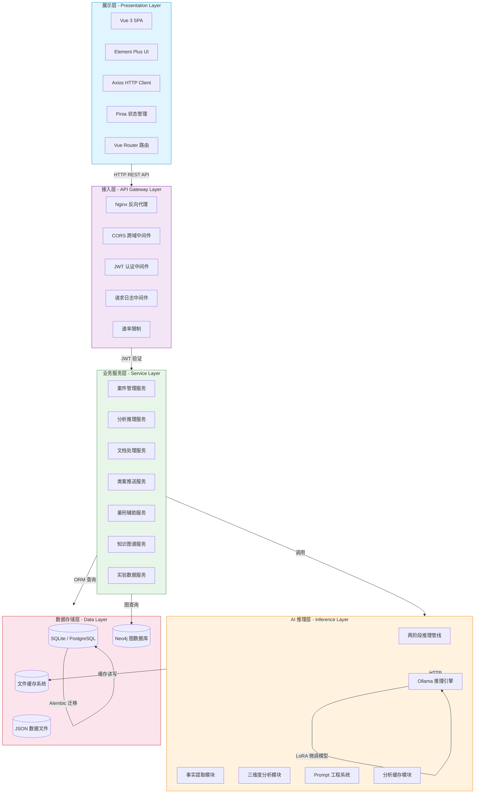
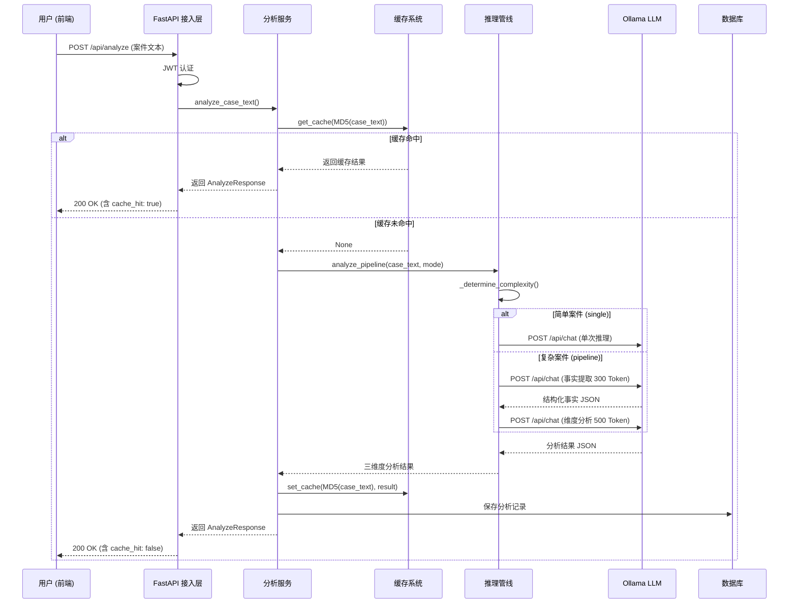
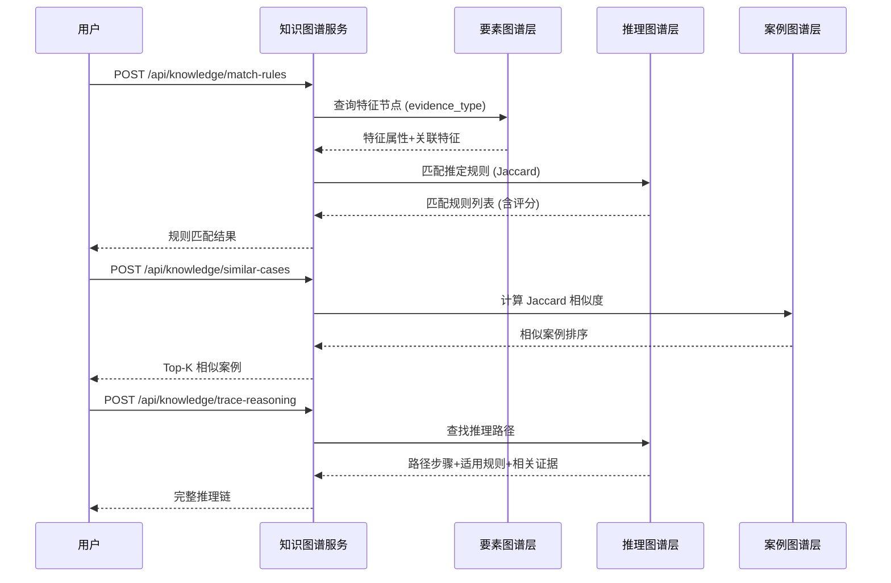
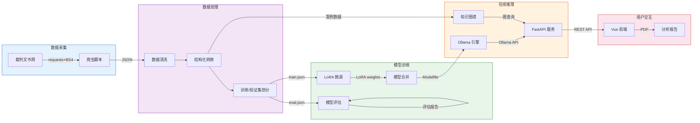

# 系统架构说明

## 1. 系统概述

帮信罪主观明知分析系统采用**前后端分离的五层架构**设计，以 FastAPI 异步框架为核心，集成大语言模型推理引擎和知识图谱服务，为司法人员提供标准化的案件分析辅助能力。

## 2. 五层架构

### 2.1 各层级模块职责

#### 展示层（Presentation Layer）

| 模块 | 技术栈 | 职责说明 |
|------|--------|---------|
| SPA 前端 | Vue 3 + Vite | 单页应用，提供完整的用户交互界面 |
| 状态管理 | Pinia | 全局状态管理，管理用户认证、案件数据、分析结果 |
| 路由管理 | Vue Router | 页面路由分发，支持命名视图与嵌套路由 |
| HTTP 客户端 | Axios | 封装 REST API 调用，统一错误处理和认证令牌刷新 |
| 报表生成 | html2canvas + jsPDF | 支持分析报告的导出为 PDF 格式 |

#### 接入层（API Gateway Layer）

| 模块 | 职责说明 |
|------|---------|
| CORS 中间件 | 配置跨域资源共享，支持开发环境的多端口访问 |
| JWT 认证中间件 | 验证请求中的 Access Token 和 Refresh Token |
| 请求日志中间件 | 记录所有请求的方法、路径、状态码和响应时间 |
| 健康检查 | 提供 `/api/health` 端点监控服务状态 |

#### 业务服务层（Service Layer）

| 服务模块 | 核心功能 | 数据源 |
|---------|---------|--------|
| 案件管理服务 | CRUD 操作、分页查询、状态筛选 | SQLAlchemy ORM |
| 分析推理服务 | 案件文本分析、自动复杂度判定、缓存管理 | Ollama + Cache |
| 文档处理服务 | PDF/DOCX 解析、NLP 实体抽取 | 文件系统 + PP-UIE |
| 类案推送服务 | Jaccard 相似度计算、特征匹配排序 | 知识图谱 + JSON DB |
| 量刑辅助服务 | 量刑建议生成、历史案例参考 | 本地案例数据库 |
| 知识图谱服务 | 三层图结构查询、规则匹配、推理路径追溯 | Neo4j / 内存图 |
| 实验数据服务 | 随机分组、判断采集、统计分析 | SQLAlchemy ORM |

#### AI 推理层（Inference Layer）

| 模块 | 说明 |
|------|------|
| 两阶段推理管线 | 简单案件单次推理，复杂案件先提取结构化事实再分析 |
| 事实提取模块 | 从原始案件文本中提取行为人、行为、工具、通讯、获利、辩解六要素（~300 Token） |
| 三维度分析模块 | 基于结构化事实进行客观行为异常度、认知能力匹配度、辩解合理性分析（~500 Token） |
| Prompt 工程系统 | 分级提示词（单次/管线/增强版），注入《帮信解释》第11条摘要 |
| 分析缓存模块 | MD5 文件缓存，7 天 TTL，支持统计与手动清理 |
| Ollama 推理引擎 | 本地部署的 LLM 推理服务，兼容 OpenAI API 格式 |

#### 数据存储层（Data Layer）

| 存储系统 | 类型 | 用途 |
|---------|------|------|
| SQLite / PostgreSQL | 关系型数据库 | 用户、案件、分析记录、法律规则、系统日志、模型版本 |
| Neo4j | 图数据库 | 三层知识图谱（要素图谱层、推理图谱层、案例图谱层） |
| 文件缓存系统 | JSON 文件 | 分析结果缓存（MD5 索引，7 天有效期） |
| JSON 数据文件 | 文件系统 | 原始裁判文书、实验案例数据、训练数据集 |

## 3. 核心数据流

### 3.1 案件分析主流程

### 3.2 知识图谱查询流程

### 3.3 数据流转全景

## 4. 关键技术选型

### 4.1 后端技术栈

| 技术 | 版本 | 选型理由 |
|------|------|---------|
| Python | 3.11 | 丰富的 AI/ML 生态，异步支持完善 |
| FastAPI | 0.111+ | 高性能异步框架，原生 Pydantic 数据校验，自动生成 OpenAPI 文档 |
| SQLAlchemy | 2.0+ | 强大的 ORM 框架，支持多数据库后端，Alembic 迁移 |
| Uvicorn | - | 高性能 ASGI 服务器，支持热重载 |
| httpx | - | 异步 HTTP 客户端，用于调用 Ollama API |
| Pydantic | v2 | 数据模型定义与校验，FastAPI 深度集成 |
| loguru | - | 零配置日志系统，支持文件轮转和结构化日志 |

### 4.2 前端技术栈

| 技术 | 版本 | 选型理由 |
|------|------|---------|
| Vue | 3.4+ | 组合式 API，TypeScript 友好，轻量高效 |
| Vite | 5.2+ | 极速开发服务器，ESM 原生支持 |
| Pinia | 2.1+ | Vue 3 官方推荐状态管理，TypeScript 类型安全 |
| Vue Router | 4.3+ | SPA 路由管理，支持懒加载 |
| Axios | 1.6+ | 拦截器机制，统一错误处理 |
| html2canvas | - | 前端截图，用于报告导出 |
| jsPDF | - | PDF 文件生成 |

### 4.3 AI 与数据处理

| 技术 | 用途 |
|------|------|
| Ollama | 本地 LLM 推理服务，支持自定义 Modelfile |
| Unsloth | 高效 LoRA 微调框架，4-bit 量化训练，优化显存使用 |
| Hugging Face Transformers | 模型加载与推理 |
| TRL (SFTTrainer) | 监督微调训练器 |
| Datasets | 数据加载与预处理 |
| sacrebleu / rouge_score | BLEU / ROUGE 自动评估指标 |
| BERTScore | 语义相似度评估 |
| TensorBoard | 训练监控与可视化 |

### 4.4 数据存储

| 技术 | 用途 |
|------|------|
| SQLite | 开发环境数据库，零配置 |
| PostgreSQL | 生产环境数据库（可切换） |
| Neo4j | 图数据库，存储三层知识图谱 |
| Alembic | 数据库 Schema 版本迁移管理 |

### 4.5 知识图谱

| 技术 | 用途 |
|------|------|
| Neo4j | 图数据库（生产环境推荐） |
| 内存图存储 | Neo4j 不可用时的回退方案 |
| Jaccard 相似度 | 类案检索核心算法 |
| Cypher | 图查询语言 |

## 5. 系统关键设计决策

### 5.1 两阶段推理管线

针对法律文本分析的特殊需求，系统实现了分级推理策略：

- **简单案件**（文本 < 2000 字且行为人 <= 3）：单次推理，直接输出三维度分析
- **复杂案件**：两阶段推理
  - Stage 1: 事实提取（~300 Token 提示词，6 个结构化字段）
  - Stage 2: 维度分析（~500 Token 提示词，基于结构化事实）

Token 消耗对比：单次 ~2500 Token / 管线 ~2900 Token（增加 16%，但复杂案件准确率显著提升）

### 5.2 三层知识图谱架构

知识图谱采用分层设计，对应法律推理的不同抽象层次：

- **要素图谱层**：12 个特征节点 + 15 条关系边，映射《帮信解释》第 11 条
- **推理图谱层**：6 条推定规则 + 3 条典型推理路径
- **案例图谱层**：25 个贵州帮信罪案例

### 5.3 缓存策略

- 缓存粒度：案件文本 MD5 摘要（前 16 位）
- 有效期：7 天（可配置）
- 存储方式：JSON 文件（`.cache/` 目录）
- 统计追踪：命中率、条目数、过期条目数

### 5.4 安全性设计

- JWT 双 Token 机制（Access Token 30 分钟 / Refresh Token 7 天）
- JWT 密钥安全增强：
  - 禁止硬编码默认密钥，强制从环境变量读取
  - 生产环境未配置密钥将阻止应用启动并输出明确错误
  - 提供密钥生成脚本（`scripts/generate_jwt_secret.py`）生成符合密码学安全要求的随机密钥（≥256 位）
  - 开发环境未配置时显示安全警告但允许继续运行
- 密码 bcrypt 哈希存储
- 管理员/普通用户两级权限
- CORS 白名单配置
- 请求日志审计（记录用户、IP、操作、时间）
