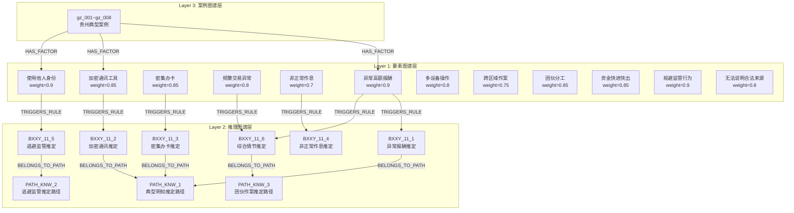
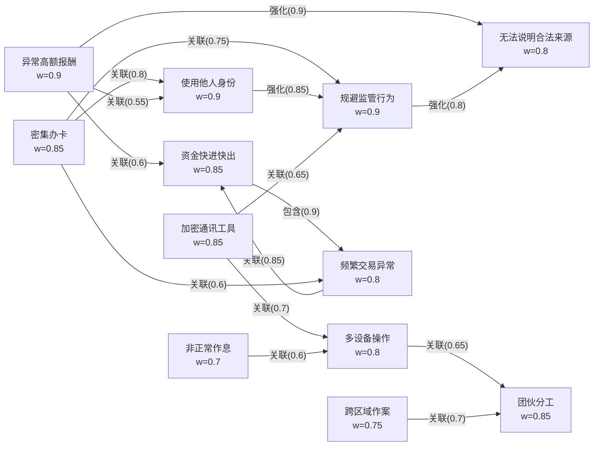
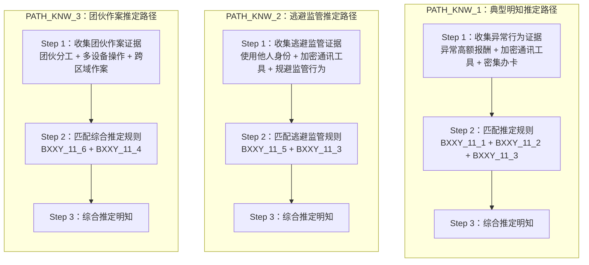

# 知识图谱技术文档

## 概述

知识图谱服务是系统的核心推理引擎，采用**三层架构**设计，为帮信罪案件分析提供特征匹配、规则推理和案例检索能力。系统同时支持 **Neo4j 图数据库**（生产环境）和**内存图存储**（回退方案）两种后端。

### 架构总览

三层图谱分别是：

| 层级 | 名称 | 说明 |
|------|------|------|
| Layer 1 | 要素图谱层（Feature Graph Layer） | 定义 12 个特征节点及其属性、权重、15 条特征间关系 |
| Layer 2 | 推理图谱层（Reasoning Graph Layer） | 基于《帮信解释》第 11 条的 6 条推定规则和 3 条推理路径 |
| Layer 3 | 案例图谱层（Case Graph Layer） | 8 个贵州本地案例，含案情、判决、关键要素 |



---

## 1. 要素图谱层（Feature Graph Layer）

要素图谱层定义了 12 个特征节点（FeatureNode），每个节点包含名称、描述、识别标准、权重、数据类型和来源法条。

### 1.1 特征节点

| 名称 | 权重 | 数据类型 | 识别标准 | 来源 |
|------|------|----------|----------|------|
| 异常高额报酬 | 0.9 | float | 单笔报酬超过当地月平均工资 3 倍以上；或累计报酬显著超出正常劳务价值 | 帮信罪司法解释第十一条 |
| 加密通讯工具 | 0.85 | boolean | 使用 Telegram、Signal 等加密通讯软件；或使用具有自动销毁消息功能的工具 | 帮信罪司法解释第十一条 |
| 密集办卡 | 0.85 | integer | 同一人在 3 个月内办理 5 张以上银行卡；或办理 10 张以上电话卡 | 帮信罪司法解释第十一条 |
| 频繁交易异常 | 0.8 | float | 日均交易笔数超过正常水平 5 倍以上；或单日交易金额超过账户历史峰值 | 帮信罪司法解释第十一条 |
| 非正常作息 | 0.7 | boolean | 长期在夜间（22:00-6:00）进行高频操作；或无固定作息规律 | 帮信罪司法解释第十一条 |
| 使用他人身份 | 0.9 | boolean | 冒用他人身份信息办理银行卡、手机卡；或使用虚假身份证件 | 帮信罪司法解释第十一条 |
| 多设备操作 | 0.8 | boolean | 同时使用 3 台以上设备进行操作；或使用 GOIP 等虚拟拨号设备 | 帮信罪司法解释第十一条 |
| 跨区域作案 | 0.75 | boolean | 开卡地与使用地跨省；或资金流转涉及多个省市 | 帮信罪司法解释第十一条 |
| 团伙分工 | 0.85 | boolean | 三人以上分工明确的作案团伙；或存在组织者、实施者、技术支持的层级结构 | 帮信罪司法解释第十一条 |
| 资金快进快出 | 0.85 | boolean | 资金到账后 5 分钟内即转出；或单日资金流转超过 5 轮 | 帮信罪司法解释第十一条 |
| 规避监管行为 | 0.9 | boolean | 拆分大额交易逃避反洗钱监控；或使用多人账户分散资金 | 帮信罪司法解释第十一条 |
| 无法说明合法来源 | 0.8 | boolean | 不能提供合法收入证明；或解释明显不符合常理 | 帮信罪司法解释第十一条 |

### 1.2 特征间关系

特征节点之间通过三种关系类型连接，形成语义网络：

- **强化**：一个特征的出现会显著增强另一特征的可信度
- **关联**：两个特征在逻辑上存在关联关系
- **包含**：一个特征是另一特征的具体表现形式



完整的关系数据如下表：

| 源节点 | 目标节点 | 关系类型 | 权重 |
|--------|----------|----------|------|
| 异常高额报酬 | 无法说明合法来源 | 强化 | 0.9 |
| 异常高额报酬 | 资金快进快出 | 关联 | 0.6 |
| 加密通讯工具 | 多设备操作 | 关联 | 0.7 |
| 密集办卡 | 使用他人身份 | 关联 | 0.8 |
| 密集办卡 | 规避监管行为 | 关联 | 0.75 |
| 频繁交易异常 | 资金快进快出 | 关联 | 0.85 |
| 非正常作息 | 多设备操作 | 关联 | 0.6 |
| 使用他人身份 | 规避监管行为 | 强化 | 0.85 |
| 多设备操作 | 团伙分工 | 关联 | 0.65 |
| 跨区域作案 | 团伙分工 | 关联 | 0.7 |
| 资金快进快出 | 频繁交易异常 | 包含 | 0.9 |
| 规避监管行为 | 无法说明合法来源 | 强化 | 0.8 |
| 异常高额报酬 | 使用他人身份 | 关联 | 0.55 |
| 密集办卡 | 频繁交易异常 | 关联 | 0.6 |
| 加密通讯工具 | 规避监管行为 | 关联 | 0.65 |

---

## 2. 推理图谱层（Reasoning Graph Layer）

推理图谱层基于《关于办理非法利用信息网络、帮助信息网络犯罪活动等刑事案件适用法律若干问题的解释》第十一条，构建了 6 条推定规则和 3 条推理路径。

### 2.1 推定规则

| 规则编号 | 名称 | 法条依据 | 证据类型 | 权重 |
|----------|------|----------|----------|------|
| BXXY_11_1 | 异常报酬推定规则 | 第十一条第（一）项 | 异常高额报酬、资金快进快出 | 0.9 |
| BXXY_11_2 | 加密通讯推定规则 | 第十一条第（二）项 | 加密通讯工具 | 0.85 |
| BXXY_11_3 | 密集办卡推定规则 | 第十一条第（三）项 | 密集办卡、使用他人身份、加密通讯工具、规避监管行为 | 0.85 |
| BXXY_11_4 | 非正常作息推定规则 | 第十一条第（四）项 | 非正常作息、多设备操作 | 0.75 |
| BXXY_11_5 | 逃避监管推定规则 | 第十一条第（五）项 | 使用他人身份、规避监管行为、加密通讯工具 | 0.85 |
| BXXY_11_6 | 综合情节推定规则 | 第十一条第（六）项 | 全部 12 个特征 | 0.7 |

#### BXXY_11_1：异常报酬推定规则

```
条件：交易价格明显异常 ∧ 交易方式明显异常
结论：可以推定行为人"明知"他人利用信息网络实施犯罪
证据：异常高额报酬、资金快进快出
权重：0.9
```

#### BXXY_11_2：加密通讯推定规则

```
条件：使用加密通讯工具 ∧ 使用隐蔽通讯方法
结论：可以推定行为人"明知"他人利用信息网络实施犯罪
证据：加密通讯工具
权重：0.85
```

#### BXXY_11_3：密集办卡推定规则

```
条件：频繁采用隐蔽上网措施 ∨ 使用加密通信 ∨ 销毁数据 ∨ 使用虚假身份
结论：可以推定行为人"明知"他人利用信息网络实施犯罪
证据：密集办卡、使用他人身份、加密通讯工具、规避监管行为
权重：0.85
```

#### BXXY_11_4：非正常作息推定规则

```
条件：为他人提供程序工具 ∧ 作息时间异常 ∧ 与正常劳务活动不符
结论：可以推定行为人"明知"他人利用信息网络实施犯罪
证据：非正常作息、多设备操作
权重：0.75
```

#### BXXY_11_5：逃避监管推定规则

```
条件：使用虚假身份 ∧ 采取隐蔽上网方式 ∧ 逃避监管
结论：可以推定行为人"明知"他人利用信息网络实施犯罪
证据：使用他人身份、规避监管行为、加密通讯工具
权重：0.85
```

#### BXXY_11_6：综合情节推定规则

```
条件：存在多项异常行为 ∧ 全案证据相互印证
结论：可以综合认定为"明知"
证据：全部 12 个特征
权重：0.7
```

### 2.2 推理路径

三条推理路径分别对应不同的作案模式，每个路径由多个步骤组成，每个步骤关联到特定的推定规则和证据类型。



#### PATH_KNW_1：典型明知推定路径

通过异常报酬 + 加密通讯 + 密集办卡等特征组合推定明知。

| 步骤 | 类型 | 描述 | 关联规则/证据 |
|------|------|------|-------------|
| 1 | evidence | 收集异常行为证据 | 异常高额报酬、加密通讯工具、密集办卡 |
| 2 | rule_matching | 匹配推定规则 | BXXY_11_1、BXXY_11_2、BXXY_11_3 |
| 3 | reasoning | 综合推定明知 | 结论：可以推定行为人"明知"他人利用信息网络实施犯罪 |

#### PATH_KNW_2：逃避监管推定路径

通过虚假身份 + 加密工具 + 规避监管等特征推定明知。

| 步骤 | 类型 | 描述 | 关联规则/证据 |
|------|------|------|-------------|
| 1 | evidence | 收集逃避监管证据 | 使用他人身份、加密通讯工具、规避监管行为 |
| 2 | rule_matching | 匹配逃避监管规则 | BXXY_11_5、BXXY_11_3 |
| 3 | reasoning | 综合推定明知 | 结论：可以推定行为人"明知"他人利用信息网络实施犯罪 |

#### PATH_KNW_3：团伙作案推定路径

通过团伙分工 + 多设备 + 跨区域等特征推定明知。

| 步骤 | 类型 | 描述 | 关联规则/证据 |
|------|------|------|-------------|
| 1 | evidence | 收集团伙作案证据 | 团伙分工、多设备操作、跨区域作案 |
| 2 | rule_matching | 匹配综合推定规则 | BXXY_11_6、BXXY_11_4 |
| 3 | reasoning | 综合推定明知 | 结论：可以推定行为人"明知"他人利用信息网络实施犯罪 |

### 2.3 规则与证据的映射关系

每条推定规则关联一组证据类型（特征节点），证据通过 `TRIGGERS_RULE` 关系触发规则：

```
异常高额报酬 ──TRIGGERS_RULE──→ BXXY_11_1
加密通讯工具 ──TRIGGERS_RULE──→ BXXY_11_2
密集办卡 ──TRIGGERS_RULE──→ BXXY_11_3
使用他人身份 ──TRIGGERS_RULE──→ BXXY_11_3
加密通讯工具 ──TRIGGERS_RULE──→ BXXY_11_3
规避监管行为 ──TRIGGERS_RULE──→ BXXY_11_3
非正常作息 ──TRIGGERS_RULE──→ BXXY_11_4
多设备操作 ──TRIGGERS_RULE──→ BXXY_11_4
使用他人身份 ──TRIGGERS_RULE──→ BXXY_11_5
规避监管行为 ──TRIGGERS_RULE──→ BXXY_11_5
加密通讯工具 ──TRIGGERS_RULE──→ BXXY_11_5
全部特征 ──TRIGGERS_RULE──→ BXXY_11_6
```

---

## 3. 案例图谱层（Case Graph Layer）

案例图谱层包含 8 个贵州本地典型案例（案件编号 `gz_001` 至 `gz_008`）。每个案例通过 `HAS_FACTOR` 关系连接到相关的特征节点。

### 3.1 案例列表

| 编号 | 标题 | 法院 | 年份 | 类型 | 刑期 | 缓刑 |
|------|------|------|------|------|------|------|
| gz_001 | 贵阳市南明区李某掩饰、隐瞒犯罪所得案 | 贵阳市南明区人民法院 | 2023 | 掩饰、隐瞒犯罪所得罪 | 8 个月 | 是（1 年） |
| gz_002 | 遵义市汇川区王某掩饰、隐瞒犯罪所得案 | 遵义市汇川区人民法院 | 2024 | 掩饰、隐瞒犯罪所得罪 | 10 个月 | 否 |
| gz_003 | 毕节市七星关区张某掩饰、隐瞒犯罪所得案 | 毕节市七星关区人民法院 | 2023 | 掩饰、隐瞒犯罪所得罪 | 6 个月 | 是（10 个月） |
| gz_004 | 黔东南州凯里市杨某掩饰、隐瞒犯罪所得案 | 黔东南州凯里市人民法院 | 2024 | 掩饰、隐瞒犯罪所得罪 | 1 年 2 个月 | 否 |
| gz_005 | 六盘水市钟山区陈某掩饰、隐瞒犯罪所得案 | 六盘水市钟山区人民法院 | 2023 | 掩饰、隐瞒犯罪所得罪 | 9 个月 | 是（1 年） |
| gz_006 | 安顺市西秀区刘某掩饰、隐瞒犯罪所得案 | 安顺市西秀区人民法院 | 2024 | 掩饰、隐瞒犯罪所得罪 | 1 年 | 是（1 年 6 个月） |
| gz_007 | 黔南州都匀市罗某掩饰、隐瞒犯罪所得案 | 黔南州都匀市人民法院 | 2023 | 掩饰、隐瞒犯罪所得罪 | 4 个月（拘役） | 是（6 个月） |
| gz_008 | 铜仁市碧江区吴某掩饰、隐瞒犯罪所得案 | 铜仁市碧江区人民法院 | 2024 | 掩饰、隐瞒犯罪所得罪 | 7 个月 | 否 |

### 3.2 案例关键要素

每个案例包含一组关键要素（key_factors），用于相似案例匹配：

| 案例 | price_anomaly | cash_transaction | anonymous_communication | repeat_purchase | normal_business |
|------|:-------------:|:----------------:|:----------------------:|:---------------:|:---------------:|
| gz_001 | ✓ | ✓ | ✓ | ✓ | ✗ |
| gz_002 | ✓ | ✗ | ✓ | ✓ | ✗ |
| gz_003 | ✓ | ✓ | ✗ | ✗ | ✓ |
| gz_004 | ✗ | ✓ | ✗ | ✗ | ✗ |
| gz_005 | ✓ | ✗ | ✓ | ✓ | ✗ |
| gz_006 | ✓ | ✓ | ✓ | ✓ | ✓ |
| gz_007 | ✓ | ✓ | ✗ | ✗ | ✓ |
| gz_008 | ✗ | ✗ | ✓ | ✗ | ✗ |

---

## 4. 核心查询接口

知识图谱服务提供四个核心查询接口，均在 `KnowledgeGraphService` 类中实现。

### 4.1 获取完整图谱

```python
knowledge_graph_service.get_full_graph()
```

返回三层图谱的所有节点和边，包含完整的节点属性与边属性。

**响应结构**：
```json
{
  "nodes": [
    {
      "id": "feature:异常高额报酬",
      "labels": ["Feature", "ElementFeature"],
      "name": "异常高额报酬",
      "weight": 0.9,
      "data_type": "float",
      ...
    }
  ],
  "edges": [
    {
      "from": "feature:异常高额报酬",
      "to": "feature:无法说明合法来源",
      "type": "强化",
      "properties": {"relation": "强化", "weight": 0.9}
    }
  ],
  "node_count": <总数>,
  "edge_count": <总数>
}
```

### 4.2 规则匹配

```python
knowledge_graph_service.match_rules(evidence_type: str)
```

根据证据类型匹配适用的推定规则。匹配策略：

1. **精确匹配**：证据类型与规则的 `evidence_types` 完全匹配，得分 `1.0`
2. **部分匹配**：证据类型与规则的 `evidence_types` 存在包含关系，得分 `0.6`
3. 结果按匹配得分降序排列
4. 同时返回匹配特征的相关特征（通过特征间关系查询）

**请求示例**：
```json
{"evidence_type": "异常高额报酬"}
```

**响应示例**：
```json
{
  "evidence_type": "异常高额报酬",
  "feature_info": {"name": "异常高额报酬", "weight": 0.9, ...},
  "related_features": [
    {"name": "无法说明合法来源", "relation": "强化", "weight": 0.9},
    {"name": "资金快进快出", "relation": "关联", "weight": 0.6},
    {"name": "使用他人身份", "relation": "关联", "weight": 0.55}
  ],
  "matched_rules": [
    {
      "rule_id": "BXXY_11_1",
      "name": "异常报酬推定规则",
      "match_score": 1.0,
      "match_type": "精确匹配",
      ...
    },
    {
      "rule_id": "BXXY_11_6",
      "name": "综合情节推定规则",
      "match_score": 0.6,
      "match_type": "部分匹配",
      ...
    }
  ],
  "total_matches": 2,
  "query_time": "2026-05-24T..."
}
```

### 4.3 相似案例检索

```python
knowledge_graph_service.find_similar_cases(
    case_features: list[str],
    top_k: int = 5
)
```

基于 Jaccard 相似度和特征权重计算案例相似度。相似度计算公式：

```
similarity = 0.4 × Jaccard + 0.4 × 加权得分 + 0.2 × 特征覆盖率

其中：
  Jaccard = |查询特征 ∩ 案例特征| / |查询特征 ∪ 案例特征|
  加权得分 = sum(匹配特征的权重) / max(匹配特征数, 1)
  特征覆盖率 = |查询特征 ∩ 案例特征| / |查询特征|
```

**请求示例**：
```json
{
  "case_features": ["异常高额报酬", "加密通讯工具", "密集办卡"],
  "top_k": 3
}
```

**响应示例**：
```json
{
  "cases": [
    {
      "case_id": "gz_001",
      "title": "贵阳市南明区李某掩饰、隐瞒犯罪所得案",
      "similarity": 85.5,
      "shared_features": [...],
      "missing_features": [...],
      "feature_coverage": 66.67,
      ...
    }
  ],
  "total": 3,
  "query_features": ["异常高额报酬", "加密通讯工具", "密集办卡"],
  "query_time": "2026-05-24T..."
}
```

### 4.4 推理路径追溯

```python
knowledge_graph_service.trace_reasoning(conclusion: str)
```

追溯给定结论的完整推理路径。匹配策略：

1. 优先匹配结论类型（`conclusion_type`）或路径名称（`name`）中包含查询字符串的路径
2. 若未匹配到，则尝试在路径步骤的结论中匹配
3. 若仍未匹配到，返回所有路径

每个返回的路径包含完整的步骤详情、匹配的规则和证据信息。

**请求示例**：
```json
{"conclusion": "明知推定"}
```

**响应结构**：
```json
{
  "conclusion": "明知推定",
  "total_paths": 3,
  "paths": [
    {
      "path_id": "PATH_KNW_1",
      "name": "典型明知推定路径",
      "steps": [
        {
          "order": 1,
          "type": "evidence",
          "description": "收集异常行为证据",
          "matched_rules": [...],
          "evidences": [
            {"name": "异常高额报酬", "weight": 0.9, ...},
            {"name": "加密通讯工具", "weight": 0.85, ...},
            {"name": "密集办卡", "weight": 0.85, ...}
          ]
        },
        ...
      ],
      "applicable_rules": [...]
    }
  ],
  "all_relevant_evidence": [...],
  "query_time": "2026-05-24T..."
}
```

---

## 5. RESTful API 接口

通过 FastAPI 路由暴露以下端点：

| 方法 | 路径 | 描述 | 请求体 |
|------|------|------|--------|
| GET | `/api/knowledge/graph` | 获取完整知识图谱 | 无 |
| POST | `/api/knowledge/match-rules` | 规则匹配 | `{ evidence_type: string }` |
| POST | `/api/knowledge/similar-cases` | 相似案例检索 | `{ case_features: string[], top_k: number }` |
| POST | `/api/knowledge/trace-reasoning` | 推理路径追溯 | `{ conclusion: string }` |

注册方式：

```python
# app/main.py
from app.routers import knowledge

app.include_router(knowledge.router)
```

---

## 6. 存储后端

### 6.1 Neo4j（生产环境）

通过环境变量配置 Neo4j 连接：

| 环境变量 | 说明 | 默认值 |
|----------|------|--------|
| `NEO4J_URI` | Neo4j 连接 URI | 空（未配置时使用内存存储） |
| `NEO4J_USER` | 用户名 | `neo4j` |
| `NEO4J_PASSWORD` | 密码 | 空 |

Neo4j 节点标签：

| 层级 | 标签 | 说明 |
|------|------|------|
| Layer 1 | `Feature`, `ElementFeature` | 特征节点 |
| Layer 2 | `Rule`, `ReasoningRule` | 推定规则 |
| Layer 2 | `ReasoningPath` | 推理路径 |
| Layer 2 | `ReasoningStep` | 推理步骤 |
| Layer 3 | `Case`, `JudgmentCase` | 案例节点 |

Neo4j 关系类型：

| 关系 | 说明 |
|------|------|
| `TRIGGERS_RULE` | 证据 → 规则（特征触发规则） |
| `BELONGS_TO_PATH` | 规则 → 路径（规则属于路径） |
| `HAS_STEP` | 路径 → 步骤（路径包含步骤） |
| `HAS_FACTOR` | 案例 → 特征（案例包含特征） |
| `强化` / `关联` / `包含` | 特征间语义关系 |

### 6.2 内存图存储（回退方案）

当 Neo4j 未配置或连接失败时，系统自动回退到 `_InMemoryGraph` 内存图存储。该实现支持：

- 节点/边的增删查
- 按标签和属性过滤节点
- 按方向、关系类型、深度遍历
- DFS 路径查找（最大深度可配置）

---

## 7. 示例：Cypher 查询

当连接到 Neo4j 时，可直接使用 Cypher 查询：

### 7.1 查询所有特征节点

```cypher
MATCH (f:Feature)
RETURN f.name AS name, f.weight AS weight, f.data_type AS data_type
ORDER BY f.weight DESC
```

### 7.2 查询特征间关系

```cypher
MATCH (a:Feature)-[r]->(b:Feature)
RETURN a.name AS source, type(r) AS relation, r.weight AS weight, b.name AS target
ORDER BY r.weight DESC
```

### 7.3 查询证据触发的规则

```cypher
MATCH (f:Feature {name: '异常高额报酬'})-[:TRIGGERS_RULE]->(r:ReasoningRule)
RETURN f.name AS feature, r.rule_id AS rule_id, r.name AS rule_name
```

### 7.4 查询案例关联的特征

```cypher
MATCH (c:Case {case_id: 'gz_001'})-[:HAS_FACTOR]->(f:Feature)
RETURN c.title AS case_title, f.name AS feature, f.weight AS weight
```

### 7.5 查询完整推理路径

```cypher
MATCH path = (r:ReasoningRule)-[:BELONGS_TO_PATH]->(p:ReasoningPath)-[:HAS_STEP]->(s:ReasoningStep)
RETURN p.name AS path_name, collect(DISTINCT r.rule_id) AS rules, s.description AS step
ORDER BY p.name, s.order
```

### 7.6 统计各层级的节点数量

```cypher
MATCH (f:Feature) RETURN 'Feature' AS layer, count(f) AS count
UNION ALL
MATCH (r:ReasoningRule) RETURN 'Rule' AS layer, count(r) AS count
UNION ALL
MATCH (p:ReasoningPath) RETURN 'Path' AS layer, count(p) AS count
UNION ALL
MATCH (c:Case) RETURN 'Case' AS layer, count(c) AS count
```

---

## 8. 完整图谱数据统计

| 层级 | 节点类型 | 节点数 | 边类型 | 边数 |
|------|----------|--------|--------|------|
| Layer 1: 要素图谱 | Feature | 12 | 强化/关联/包含 | 15 |
| Layer 2: 推理图谱 | ReasoningRule | 6 | TRIGGERS_RULE | 27 |
| Layer 2: 推理图谱 | ReasoningPath | 3 | HAS_STEP | 9 |
| Layer 2: 推理图谱 | ReasoningStep | 9 | BELONGS_TO_PATH | 18 |
| Layer 3: 案例图谱 | Case | 8 | HAS_FACTOR | 40 |
| **总计** | | **38** | | **109** |
