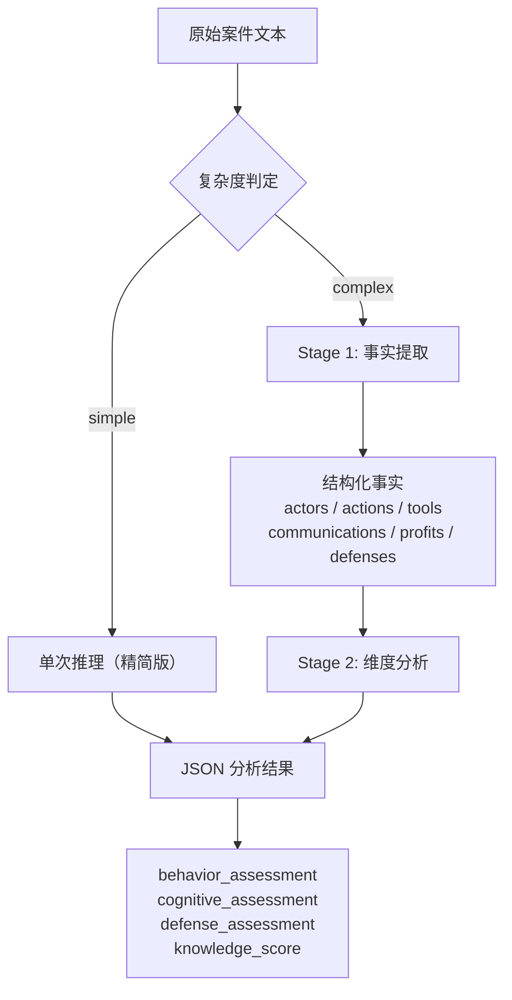

# 帮信罪主观明知分析 AI 模型文档

## 1. 模型选型（基座模型）

### 1.1 微调基座：DeepSeek-R1-Distill-Qwen-7B

微调训练选用 **deepseek-ai/DeepSeek-R1-Distill-Qwen-7B** 作为基座模型。该模型由 DeepSeek 团队发布，基于 Qwen2.5-7B 架构，通过 DeepSeek-R1 的蒸馏技术获得增强的推理能力。模型权重从 HuggingFace 加载，配置定义于 [finetune_config.yaml](file:///c:/Users/Lenovo/Desktop/微信程序开发/ml/finetune/config/finetune_config.yaml)：

```yaml
model:
  model_name_or_path: "deepseek-ai/DeepSeek-R1-Distill-Qwen-7B"
  max_seq_length: 1920
  dtype: "fp16"
  load_in_4bit: true
```

### 1.2 推理运行时：Qwen2.5:7B

生产环境中，Ollama 推理服务使用 **qwen2.5:7b** 作为运行时模型，配置于 [backend/.env](file:///c:/Users/Lenovo/Desktop/微信程序开发/backend/.env)：

```
OLLAMA_MODEL=qwen2.5:7b
OLLAMA_BASE_URL=http://localhost:8001
```

推理服务通过 Ollama API 调用该模型，LoRA 权重通过 Ollama Modelfile 加载（见 [Modelfile](file:///c:/Users/Lenovo/Desktop/微信程序开发/models/merged_model/Modelfile)）：

```
FROM qwen2.5:7b
PARAMETER temperature 0.3
PARAMETER top_p 0.9
PARAMETER stop "<|im_end|>"
PARAMETER stop "<|im_start|>"
```

### 1.3 选型理由

- **DeepSeek-R1-Distill-Qwen-7B**：兼具 DeepSeek-R1 的推理链能力和 Qwen2.5 的中文理解能力，7B 参数量级可在单卡 RTX 4090（24GB）上高效微调
- **Qwen2.5:7b**：Ollama 生态成熟、量化模型推理速度快，适合生产环境低延迟部署

## 2. 微调方法（LoRA）

### 2.1 框架选择

使用 **Unsloth** 框架实现高效 LoRA 微调。Unsloth 针对 HuggingFace Transformers 进行了底层算子优化，可显著减少显存占用并加速训练。训练流程集成 **TRL SFTTrainer**，支持 DataCollatorForCompletionOnlyLM，确保仅对 assistant 输出部分计算损失。

核心代码见 [train_lora.py](file:///c:/Users/Lenovo/Desktop/微信程序开发/scripts/train_lora.py)：

```python
from unsloth import FastLanguageModel

model, tokenizer = FastLanguageModel.from_pretrained(
    model_name=model_config["model_name_or_path"],
    max_seq_length=model_config["max_seq_length"],
    dtype=None,
    load_in_4bit=model_config["load_in_4bit"],
)

model = FastLanguageModel.get_peft_model(
    model,
    r=lora_config["lora_r"],           # 64
    target_modules=lora_config["target_modules"],  # q_proj, v_proj, k_proj, o_proj
    lora_alpha=lora_config["lora_alpha"],           # 16
    lora_dropout=lora_config["lora_dropout"],        # 0.0
    bias="none",
    use_gradient_checkpointing="unsloth",
    random_state=42,
    max_seq_length=1920,
)
```

### 2.2 量化配置

采用 **4-bit NF4（NormalFloat4）** 量化加载基座模型，使用双重量化（double_quant）进一步压缩：

```yaml
quantization:
  quant_type: "nf4"
  use_double_quant: true
  bnb_4bit_compute_dtype: "fp16"
```

NF4 是一种信息论最优的 4-bit 量化数据类型，专为正态分布权重设计，相比传统的 INT4 量化，在同等压缩比下保留了更高的模型精度。

### 2.3 LoRA 超参数

| 参数 | 值 | 说明 |
|------|-----|------|
| `lora_r` | 64 | LoRA 秩，控制可训练参数量 |
| `lora_alpha` | 16 | 缩放系数，与 rank 的比例为 0.25 |
| `lora_dropout` | 0.0 | 丢弃率，设置为 0 以充分利用有限数据 |
| `bias` | none | 不训练偏置项 |
| `task_type` | CAUSAL_LM | 因果语言模型任务 |

### 2.4 目标模块

选择注意力机制中的四个线性投影层作为 LoRA 适配目标：

- `q_proj`：Query 投影
- `v_proj`：Value 投影
- `k_proj`：Key 投影
- `o_proj`：Output 投影

### 2.5 参数量对比

训练脚本在初始化 LoRA 后自动计算并记录参数量信息：

```python
trainable_params = sum(p.numel() for p in model.parameters() if p.requires_grad)
total_params = sum(p.numel() for p in model.parameters())
logger.info(f"LoRA可训练参数: {trainable_params:,} / {total_params:,} ({trainable_params / total_params:.4%})")
```

对于 DeepSeek-R1-Distill-Qwen-7B（~7B 参数），LoRA（r=64）的参数量约为数千万级别，可训练参数占比通常低于 1%，显著降低了显存需求和过拟合风险。

## 3. 训练配置

### 3.1 硬件环境

| 项目 | 规格 |
|------|------|
| GPU | NVIDIA RTX 4090（24GB） |
| 显存上限 | 22 GB |
| 显存优化 | 启用（gradient checkpointing） |

### 3.2 超参数总览

```yaml
training:
  num_train_epochs: 3
  per_device_train_batch_size: 4
  gradient_accumulation_steps: 4
  learning_rate: 2.0e-4
  weight_decay: 0.01
  warmup_ratio: 0.1
  lr_scheduler_type: "cosine"
  logging_steps: 10
  save_steps: 100
  save_total_limit: 3
  fp16: true
  bf16: false
  max_grad_norm: 1.0
  optim: "adamw_torch"
  seed: 42
  report_to: "tensorboard"
```

### 3.3 关键参数解读

**有效批次大小**：`per_device_train_batch_size (4) × gradient_accumulation_steps (4) = 16`。在单卡 RTX 4090 上，通过梯度累积模拟了更大的批次大小，兼顾了训练稳定性和显存限制。

**学习率调度**：余弦退火（Cosine）调度器，初始学习率 2e-4，配合 warmup_ratio=0.1（前 10% 的步数线性预热），逐步降低学习率至接近零。

**混合精度**：FP16 混合精度训练（`fp16: true`），在保持模型精度的同时将训练速度提升约 2 倍。

**梯度裁剪**：`max_grad_norm: 1.0`，防止梯度爆炸。

**优化器**：AdamW（`adamw_torch`），带权重衰减的正则化版本。

**随机种子**：`seed: 42`，确保实验可复现。

**训练监控**：使用 TensorBoard 记录训练过程中的损失曲线和学习率变化，日志路径为 `logs/tensorboard/`。

```python
training_args = TrainingArguments(
    output_dir=lora_weights_path,
    num_train_epochs=3,
    per_device_train_batch_size=4,
    gradient_accumulation_steps=4,
    learning_rate=2e-4,
    weight_decay=0.01,
    warmup_ratio=0.1,
    lr_scheduler_type="cosine",
    logging_steps=10,
    logging_dir=str(LOGS_DIR / "tensorboard"),
    save_steps=100,
    save_total_limit=3,
    fp16=True,
    max_grad_norm=1.0,
    optim="adamw_torch",
    seed=42,
    report_to="tensorboard",
    dataloader_num_workers=0,
)
```

### 3.4 训练流程

```
[1/6] 加载模型 → [2/6] 配置LoRA → [3/6] 加载训练数据
→ [4/6] 配置训练参数 → [5/6] 初始化SFTTrainer → [6/6] 开始训练
```

训练完成后，LoRA 权重保存至 `models/lora_weights/final/`，同时生成 `training_metrics.json` 记录训练指标。

## 4. 数据集

### 4.1 数据来源与规模

| 数据来源 | 数量 | 格式 |
|----------|------|------|
| 网络爬虫获取的已公开裁判文书 | 99 件 | instruction-output 对 |
| 贵州法院系统脱敏案件 | 25 件 | instruction-output 对 |

总计 **124 条** 训练样本，覆盖支付结算型、技术支撑型、推广引流型等多种帮信罪行为模式。

### 4.2 数据格式

每条数据为 instruction-output 格式的 JSON 对象：

```json
{
  "instruction": "请分析以下案件事实：\n\n[案件文本]",
  "output": "{\"behavior_assessment\": {...}, \"cognitive_assessment\": {...}, ...}"
}
```

### 4.3 训练/评估拆分

配置文件指定：

```yaml
data:
  train_data_path: "./data/train.json"
  eval_data_path: "./data/eval.json"
  dataset_field:
    prompt: "instruction"
    response: "output"
```

训练脚本同时支持 JSON、JSONL、CSV 格式的输入数据。

### 4.4 Chat Template 格式

数据集通过 Qwen 的 chat template 进行格式化，转换为标准的消息序列：

```python
def format_chat_template(examples):
    texts = []
    for prompt, response in zip(examples[prompt_field], examples[response_field]):
        messages = [
            {"role": "user", "content": prompt},
            {"role": "assistant", "content": response},
        ]
        text = tokenizer.apply_chat_template(
            messages,
            tokenize=False,
            add_generation_prompt=False,
        )
        texts.append(text)
    return {"text": texts}
```

训练时使用 `DataCollatorForCompletionOnlyLM`，仅对 assistant 回复部分计算损失，不对 user 输入部分做损失计算。

## 5. 两阶段推理管线

系统采用 [pipeline.py](file:///c:/Users/Lenovo/Desktop/微信程序开发/backend/app/services/pipeline.py) 实现的两阶段推理管线，根据案件复杂度自动选择推理模式。

### 5.1 复杂度判定逻辑

```python
def _determine_complexity(case_text: str) -> str:
    if len(case_text) > 2000:
        return "complex"
    if _count_actors(case_text) > 3:
        return "complex"
    return "simple"
```

判定规则：文本长度超过 2000 字或涉案行为人多于 3 人时，自动切换至两阶段管线。

### 5.2 架构总览



### 5.3 Stage 1：事实提取（~300 Token）

使用极简提示词，专注于从原始文本中提取六个关键字段的结构化信息：

| 字段 | 说明 | 长度限制 |
|------|------|----------|
| `actors` | 行为人信息 | 50 字 |
| `actions` | 关键行为 | 50 字 |
| `tools` | 使用的工具/通讯方式 | 50 字 |
| `communications` | 通讯特征 | 50 字 |
| `profits` | 获利情况 | 50 字 |
| `defenses` | 辩解内容 | 50 字 |

缺失字段自动填充为"无相关信息"，超出长度自动截断。

### 5.4 Stage 2：维度分析（~500 Token）

基于第一阶段提取的结构化事实，从三个维度进行法律分析：

1. **客观行为异常度**（`behavior_assessment`）：评估行为是否偏离正常交易/通讯模式
2. **认知能力与作案模式匹配度**（`cognitive_assessment`）：评估行为人认知水平与典型犯罪模式的匹配程度
3. **辩解合理性**（`defense_assessment`）：评估嫌疑人辩解的逻辑合理性和可信度

### 5.5 Token 预算对比

| 模式 | Token 消耗 | 适用场景 |
|------|------------|----------|
| 单次推理 | 输入 ~1500 + 输出 ~1000 = ~2500 Token | 简单案件 |
| 两阶段管线 | Stage 1: ~800 + ~300 = ~1100<br/>Stage 2: ~800 + ~1000 = ~1800<br/>总计: ~2900 Token | 复杂案件 |

两阶段管线相比单次推理增加约 16% 的 Token 消耗，但复杂案件的准确率显著提升。

## 6. Prompt 工程

### 6.1 系统提示词设计

系统提示词（~280 Token）定义了模型的角色定位、分析维度和输出规范，详见 [prompts.py](file:///c:/Users/Lenovo/Desktop/微信程序开发/backend/app/services/prompts.py)：

```
你是检察官助理，负责分析帮信罪案件中的"主观明知"要素。

## 分析维度
维度一：客观行为异常度
维度二：认知能力与作案模式匹配度
维度三：辩解合理性

## 输出JSON格式
{
  "behavior_assessment": {"score": 0, "reasoning": "", "key_indicators": [""]},
  "cognitive_assessment": {"score": 0, "reasoning": "", "pattern_match": ""},
  "defense_assessment": {"score": 0, "reasoning": "", "contradictions": [""]},
  "overall_summary": "",
  "evidence_refs": ["", "", ""],
  "knowledge_score": 0
}

## 评分标准
0-3分：确实不明知
4-6分：可能不明知或可能明知
7-10分：明显明知
```

### 6.2 Fallback 增强机制

当需要更严格的法律分析时，使用 `build_fallback_messages` 注入《帮信解释》第 11 条摘要（~200 Token 增强内容），总计 ~480 Token：

```
## 《帮信解释》第11条关键情形摘要
以下情形可作为认定"主观明知"的参考依据：
1. 经监管部门告知后仍实施相关行为的
2. 收取明显高于市场正常水平的费用的
3. 采用隐蔽手段逃避监管或调查的
4. 提供专门用于违法犯罪活动的技术支持或帮助的
5. 曾因同类行为被处罚或警告后再次实施的
6. 交易方式、资金流向明显异常的
7. 对明显异常的账户或交易未进行基本核实的
```

### 6.3 评分标准

所有维度采用 **0-10 分制**：

| 分数区间 | 含义 | 适用维度 |
|----------|------|----------|
| 0-3 | 确实不明知 / 完全正常 / 无匹配 / 完全不合理 | 综合评分 |
| 4-6 | 可能不明知或可能明知 | 综合评分 |
| 7-10 | 明显明知 / 极度异常 / 高度匹配 / 完全合理 | 综合评分 |

各维度独立评分：
- `behavior_assessment.score`：0（完全正常）→ 10（极度异常）
- `cognitive_assessment.score`：0（无匹配）→ 10（高度匹配典型模式）
- `defense_assessment.score`：0（完全不合理）→ 10（完全合理）
- `knowledge_score`：0（不明知）→ 10（明显明知）

### 6.4 输出约束

| 字段 | 约束 |
|------|------|
| `reasoning` | 不超过 150 字 |
| `evidence_refs` | 每条不超过 50 字，最多 3 条 |
| `contradictions` | 每条不超过 30 字，最多 3 条 |
| `overall_summary` | 不超过 200 字 |

要求仅输出 JSON，不得包含任何前言或后语。

## 7. 评估指标

评估系统由 [evaluate_model.py](file:///c:/Users/Lenovo/Desktop/微信程序开发/scripts/evaluate_model.py) 实现，支持自动评估与人工评估双轨制。

### 7.1 自动评估指标

#### BLEU-4（n-gram 精确匹配）

基于 `sacrebleu` 库计算 4-gram 精确匹配分数，应用长度惩罚因子（BP）：

$$BLEU-N = BP \cdot \exp\left(\sum_{n=1}^{N} w_n \log p_n\right)$$

取值范围 0-100。代码实现支持 sacrebleu 首选方法，并在该库不可用时提供基于字符 n-gram 的回退算法。

#### ROUGE-L（召回导向）

基于 `rouge_score` 库计算最长公共子序列（LCS）匹配：

$$P_{LCS} = \frac{LCS(X, Y)}{|Y|}, \quad R_{LCS} = \frac{LCS(X, Y)}{|X|}$$

$$F_{LCS} = \frac{(1+\beta^2) \cdot P_{LCS} \cdot R_{LCS}}{R_{LCS} + \beta^2 \cdot P_{LCS}}$$

取值范围 0-1。同时计算 ROUGE-1、ROUGE-2、ROUGE-L 的 Precision、Recall 和 F1 分数。

#### BERTScore（语义相似度）

使用 `bert-score` 库，基于 `bert-base-chinese` 预训练模型计算 token 级别余弦相似度：

$$P_{BERT} = \frac{1}{|y|} \sum_{y_j \in y} \max_{\hat{y}_i \in \hat{y}} \mathbf{y}_j^T \mathbf{\hat{y}}_i$$

$$R_{BERT} = \frac{1}{|\hat{y}|} \sum_{\hat{y}_i \in \hat{y}} \max_{y_j \in y} \mathbf{\hat{y}}_i^T \mathbf{y}_j$$

$$F_{BERT} = 2 \cdot \frac{P_{BERT} \cdot R_{BERT}}{P_{BERT} + R_{BERT}}$$

取值范围 0-1，对同义词和近义表达具有鲁棒性。

#### 领域术语准确率

构建 **80 个帮信罪领域核心术语** 的专用术语库：

```
帮助信息网络犯罪活动罪, 帮信罪, 主观明知, 明知, 应当知道,
信息网络犯罪, 支付结算, 技术支持, 资金转账, 银行卡,
支付账户, 手机卡, 网络账号, 电信网络诈骗, 网络赌博,
非法集资, 共同犯罪, 从犯, 主犯, 犯罪故意,
过失, 电信诈骗, 洗钱, 跑分, 水房,
卡商, 卡农, GOIP, VOIP, 多卡宝,
四方支付, 跑分平台, 虚拟币, USDT, OTC交易,
推定明知, 综合认定, 明知认定, 主观故意, 客观行为,
交易异常, 异常交易, 快进快出, 夜间交易, 频繁交易,
实名认证, 实名制, 断卡行动, 两卡, 涉案账户,
犯罪数额, 违法所得, 获利, 退赃退赔, 认罪认罚,
刑事判决书, 刑事裁定书, 一审, 二审, 再审,
公诉机关, 辩护人, 审判长, 审判员, 人民陪审员
```

同步配置同义词映射表（如"帮信罪"↔"帮助信息网络犯罪活动罪"，"USDT"↔"泰达币"，"GOIP"↔"GOIP设备"等），实现归一化匹配。

计算三个核心指标：
- 术语精确率 = 正确预测术语数 / 预测术语总数
- 术语召回率 = 正确预测术语数 / 参考术语总数
- 术语 F1 = 2 × P × R / (P + R)

### 7.2 人工评估方案

采用**双盲 A/B 测试**（double-blind A/B testing）方法。

#### 评估流程

1. 从测试集随机抽取 **30-50 条** 样本
2. 确保覆盖三类案件（明知 / 不明知 / 边缘）各 10-15 条
3. 每次展示案件文本和两份匿名输出（微调模型 vs 基线模型）
4. 3-5 名具有法律背景的评估员进行独立评分
5. 评估员接受 30 分钟培训

#### 评分维度

| 维度 | 权重 | 评分标准（1-5 分） |
|------|------|-------------------|
| 准确性 | 40% | 分析结论与案件事实的匹配程度 |
| 完整性 | 25% | 分析是否覆盖案件核心要素 |
| 专业性 | 20% | 法律术语使用和专业表达水平 |
| 可读性 | 15% | 输出结构和可理解性 |

#### 一致性检验

使用 **Fleiss' Kappa** 评估员间一致性，要求 ≥ 0.6。

## 8. 实验结果分析

以下结果基于 [experiment_report.md](file:///c:/Users/Lenovo/Desktop/微信程序开发/reports/experiment_report.md) 中的实证研究数据（回溯性对比实验）。

### 8.1 实验设计

| 要素 | 内容 |
|------|------|
| 研究类型 | 回溯性对比实验设计 |
| 案件来源 | 贵州法院系统，25 件已审结帮信罪案件 |
| A组（对照组） | 10 人，仅凭个人经验分析 |
| B组（实验组） | 10 人，参考 AI 辅助分析报告 |
| 总分析记录 | 500 条（每组各 250 条） |

### 8.2 AI 与判决一致率

AI 分析结论与法院生效判决的吻合度评估：

| 指标 | 数值 |
|------|------|
| 总案例数 | 25 |
| 一致案例数 | 22 |
| 一致率 | **88.0%** |
| 精确率（Precision） | 0.9474 |
| 召回率（Recall） | 0.9000 |
| F1 分数 | 0.9231 |
| 特异度（Specificity） | 0.9000 |

按难度分层：

| 案件难度 | 案例数 | 一致数 | 一致率 |
|----------|--------|--------|--------|
| 难 | 5 | 4 | 80.0% |
| 中 | 6 | 5 | 83.3% |
| 易 | 14 | 13 | 92.9% |

### 8.3 认定一致性分析（Cohen's Kappa）

| 指标 | A组（对照组） | B组（实验组） |
|------|-------------|-------------|
| 均值 Kappa | 0.256 | **0.5418** |
| 中位数 Kappa | 0.2475 | 0.5614 |
| 标准差 | 0.1813 | 0.1461 |
| 95% 置信区间 | [0.2031, 0.3092] | [0.496, 0.5822] |
| ≥0.40 占比 | 22.2% | 84.4% |

组间差异：B 组 Kappa 较 A 组提升 +0.2858（**111.64%**）。

### 8.4 效率分析

| 指标 | A组（对照组） | B组（实验组） | 变化 |
|------|-------------|-------------|------|
| 平均耗时 | 17.42 ± 5.89 min | 9.74 ± 3.71 min | **−44.1%** |
| 中位数耗时 | 16.95 min | 9.9 min | −41.6% |
| 均值差（A − B） | — | 7.68 min | P < 0.001（显著） |
| Cohen's d 效应量 | — | 1.5607 | 大效应 |

### 8.5 假设检验结果

| 假设 | 内容 | 结果 |
|------|------|------|
| H1 | B 组 Kappa ≥ 0.65 | ❌ 0.5418（未达标，但组间提升 111.6%） |
| H2 | B 组耗时显著低于 A 组 | ✅ P < 0.001（平均缩短 44.1%） |
| H3 | AI 一致率 ≥ 80% | ✅ 88.0%（达到预设目标） |

### 8.6 不一致案例分析

共 3 件不一致案例（12.0%）：

| 类型 | 数量 | 占比 |
|------|------|------|
| 假阳性（AI 高估明知） | 1 | 33.3% |
| 假阴性（AI 低估明知） | 2 | 66.7% |

可能原因：
1. AI 对间接证据的权重判断与司法实践存在偏差
2. 推定明知的成立条件判断差异
3. AI 对辩解合理性的评估与法官裁量不一致
4. 边缘案件中证据链完整度的影响
5. AI 对特殊情境（胁迫、被欺骗）的识别能力有限

### 8.7 置信度分析

| 指标 | A组（对照组） | B组（实验组） |
|------|-------------|-------------|
| 平均置信度 | 3.49 ± 1.14 | 4.06 ± 0.8 |

B 组评估者的平均置信度更高，说明 AI 辅助分析有助于增强司法人员的判断信心。

### 8.8 评估环境

| 项目 | 内容 |
|------|------|
| GPU | RTX 4090（24GB） |
| CUDA 版本 | 12.1 |
| PyTorch 版本 | 2.12.0 |
| Transformers 版本 | 4.57.6 |
| PEFT 版本 | 0.19.1 |
| 评估工具 | sacrebleu, rouge-score, bert-score |

## 9. 总结

本文档完整记录了帮信罪主观明知分析 AI 模型的选型、微调、训练、评估和部署全链路。基座模型选用 DeepSeek-R1-Distill-Qwen-7B 进行 LoRA 微调，生产环境通过 Ollama 部署 Qwen2.5:7b 运行时。两阶段推理管线根据案件复杂度自动选择分析模式，Prompt 工程融合了《帮信解释》第 11 条等法律依据。实证实验表明，AI 辅助分析可将认定一致性提升 111.6%（Kappa 0.256→0.542），分析效率提升 44.1%，AI 结论与法院判决一致率达 88.0%。
