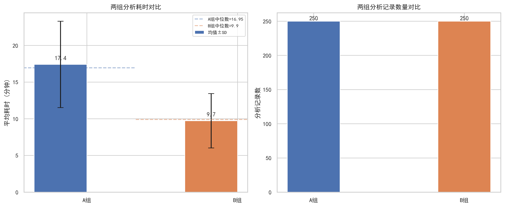
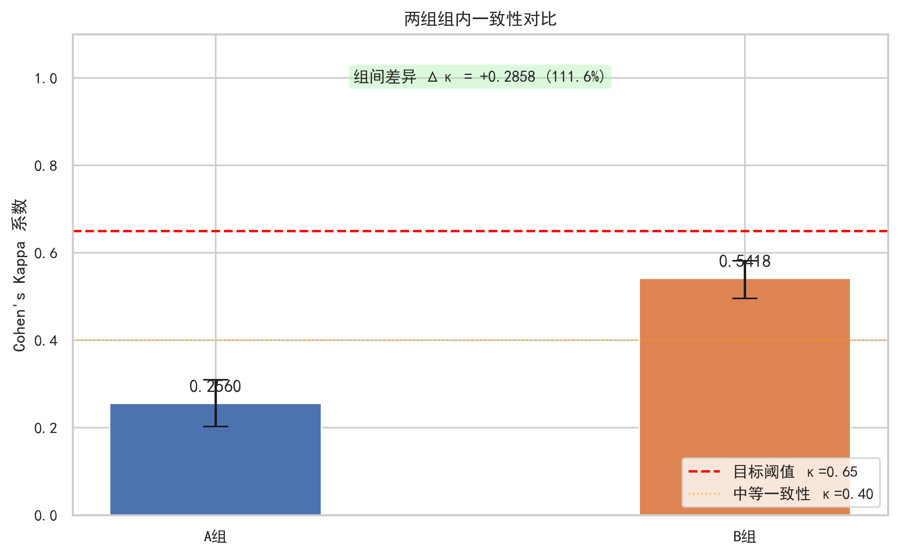
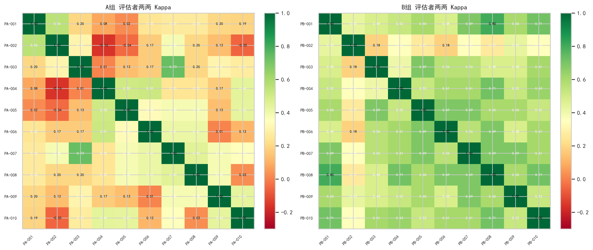
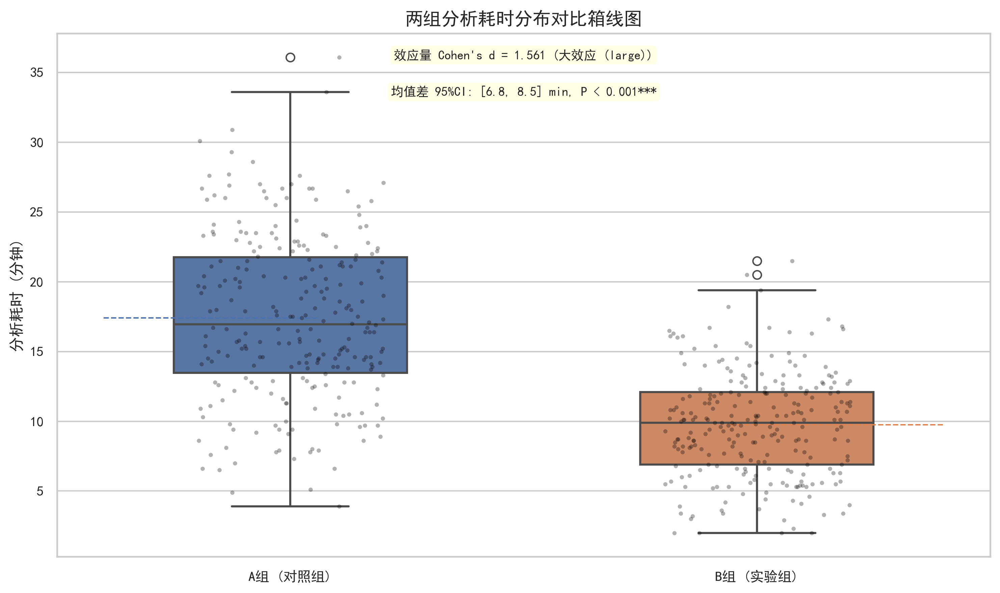
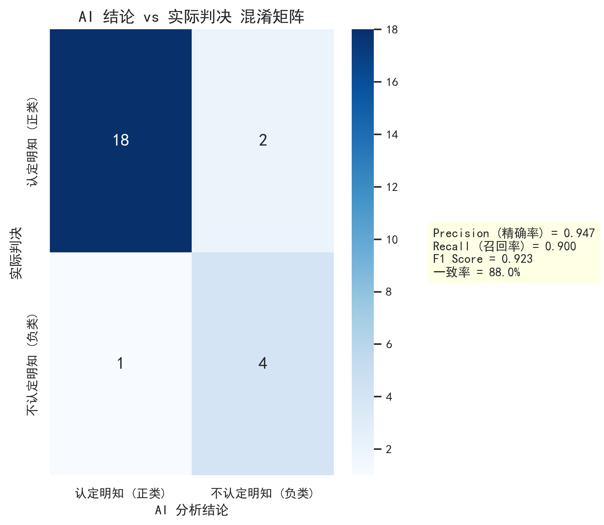
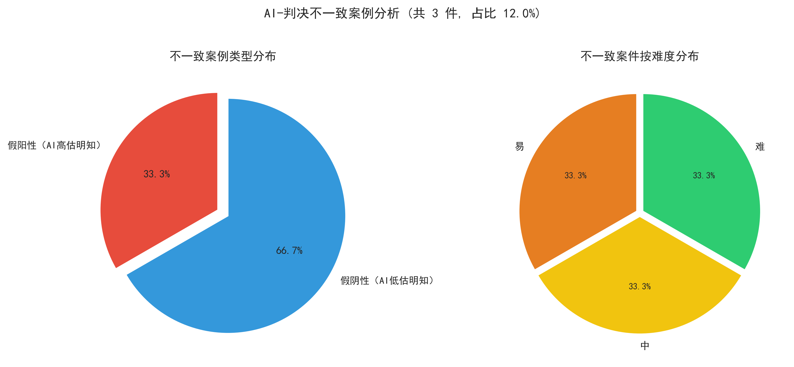

# 实证研究报告：AI辅助分析对"主观明知"认定影响的回溯性对比实验

> **报告版本**: 初稿
> **生成日期**: 2026年05月24日
> **数据来源**: 模拟数据（用于验证脚本功能）
> **⚠️ 重要提醒**: 本报告基于模拟数据生成，仅用于展示脚本输出格式和报告结构。实际分析需使用真实实验数据。
---
## 1. 研究目的
本实验旨在通过科学、严谨的回溯性对比实验设计，系统评估AI辅助分析工具对司法人员认定“主观明知”的一致性和效率的实际影响。具体包括：

- **H1**：B组（实验组）的案件认定一致性Kappa系数显著高于A组（对照组），且≥0.65
- **H2**：B组（实验组）完成单个案件分析的平均耗时显著低于A组（对照组）
- **H3**：AI分析结论与法院生效判决的吻合度达到较高水平（≥80%）

## 2. 数据来源
### 2.1 案件数据
本实验共选取 **25件** 已审结的帮助信息网络犯罪活动罪案件材料。案件涵盖不同的“主观明知”认定情形，包括认定明知、不认定明知及边缘情形。

### 2.2 参与人员
实验共有 **10名** 对照组（A组）参与者和 **10名** 实验组（B组）参与者。两组参与者在从业年限、专业背景等特征上无显著差异。

### 2.3 实验设计
实验采用回溯性对比实验设计（Retrospective Controlled Experiment Design）。A组（对照组）仅依靠个人专业经验进行分析判断；B组（实验组）在个人专业经验基础上，参考AI辅助分析工具生成的标准化分析报告进行分析判断。

### 2.4 数据规模
- 总分析记录数：**500** 条
- A组记录数：**250** 条
- B组记录数：**250** 条

## 3. 分析方法
### 3.1 描述性统计
计算各组实验数据的基本统计信息，包括案例数量、参与者人数、平均耗时（含标准差）、中位数及四分位距。采用均数±标准差（Mean ± SD）形式描述集中趋势和离散程度。

### 3.2 认定一致性分析
采用 **Cohen's Kappa 系数** 评估组内评估者间的一致性。Kappa系数的计算公式为：

$$\kappa = \frac{P_o - P_e}{1 - P_e}$$

其中，$P_o$为观察一致率，$P_e$为期望一致率。采用Bootstrap法（2000次重抽样）估计Kappa系数的95%置信区间。

一致性评判标准：κ < 0.00（低于随机）、0.00-0.20（极低）、0.20-0.40（较低）、0.40-0.60（中等）、0.60-0.80（良好）、0.80-1.00（高度）。研究假设B组Kappa ≥ 0.65视为达到良好一致性。

### 3.3 耗时差异分析
应用独立样本t检验或Mann-Whitney U检验（根据正态性检验结果选择）比较两组间平均耗时差异。统计分析包括：Shapiro-Wilk正态性检验、效应量Cohen's d、均值差的95%置信区间。显著性水平设定为α = 0.05（双尾检验）。

### 3.4 AI与判决一致率分析
以法院生效判决为金标准，将AI分析结论作为预测结果，计算准确率（Accuracy）、精确率（Precision）、召回率（Recall）、F1分数及特异度（Specificity）。同时生成混淆矩阵，以全面评估AI分析工具的分类性能。

### 3.5 不一致案例分析
对AI分析结论与实际判决不一致的案例进行系统定性分析，按差异类型（假阳性/假阴性）和案件难度分层归纳，识别AI判断的系统性偏差模式。

## 4. 结果

### 4.1 描述性统计结果

表1：两组描述性统计对比

| 指标 | A组（对照组） | B组（实验组） |
|------|-------------|-------------|
| 分析记录数 | 250 | 250 |
| 评估者人数 | 10 | 10 |
| 平均耗时 (min) | 17.42 ± 5.89 | 9.74 ± 3.71 |
| 中位数耗时 (min) | 16.95 | 9.9 |
| 四分位距 (IQR) | 8.28 | 5.2 |
| 平均置信度 | 3.49 ± 1.14 | 4.06 ± 0.8 |

*图1：两组分析耗时与记录数量对比*

### 4.2 认定一致性分析

#### 4.2.1 Cohen's Kappa 系数

表2：两组组内Cohen's Kappa系数对比

| 指标 | A组（对照组） | B组（实验组） |
|------|-------------|-------------|
| 均值 Kappa | 0.256 | 0.5418 |
| 中位数 Kappa | 0.2475 | 0.5614 |
| 标准差 | 0.1813 | 0.1461 |
| 最小值 | -0.1589 | 0.183 |
| 最大值 | 0.7331 | 0.8016 |
| 95% 置信区间 | [0.2031, 0.3092] | [0.496, 0.5822] |
| ≥0.65 占比 | 2.2% | 24.4% |
| 评估者对数 | 45 | 45 |

**组间对比**：B组Kappa（0.5418）较A组（0.256）提升0.2858（111.64%）。

*图2：两组组内一致性Kappa系数对比（含95%置信区间）*

*图3：两组评估者两两Kappa系数热力图*

#### 4.2.2 一致性水平分布

| 一致性水平 | A组（对数/占比） | B组（对数/占比） |
|-----------|-----------------|-----------------|
| 低于随机 (≥0.0) | 42/93.3% | 45/100.0% |
| 极低 (≥0.2) | 25/55.6% | 43/95.6% |
| 较低 (≥0.4) | 10/22.2% | 38/84.4% |
| 中等 (≥0.6) | 1/2.2% | 22/48.9% |
| 良好 (≥0.8) | 0/0.0% | 1/2.2% |

### 4.3 耗时差异分析

表3：两组耗时差异统计检验结果

| 指标 | 数值 |
|------|------|
| 检验方法 | Welch's t-test (独立样本) |
| A组平均耗时 | 17.42 ± 5.89 min |
| B组平均耗时 | 9.74 ± 3.71 min |
| 均值差（A - B） | 7.68 min |
| 均值差 95% CI | [6.82, 8.54] |
| 检验统计量 | 17.4491 |
| P 值 | 0.0 *** |
| 统计显著性 | 是 |
| Cohen's d 效应量 | 1.5607 (大效应 (large)) |

*图4：两组分析耗时分布箱线图（含个体数据点与统计标注）*

### 4.4 AI与判决一致率

表4：AI分析结论与实际判决一致性评估

| 指标 | 数值 |
|------|------|
| 总案例数 | 25 |
| 一致案例数 | 22 |
| 不一致案例数 | 3 |
| 一致率 | 88.0% |
| 精确率 (Precision) | 0.9474 |
| 召回率 (Recall) | 0.9000 |
| F1 分数 | 0.9231 |
| 特异度 (Specificity) | 0.9000 |
| 准确率 (Accuracy) | 0.8800 |

#### 4.4.1 按难度分层的一致率

| 案件难度 | 总案例数 | 一致数 | 一致率 |
|---------|--------|--------|-------|
| 难 | 5 | 4 | 80.0% |
| 中 | 6 | 5 | 83.3% |
| 易 | 14 | 13 | 92.9% |

*图5：AI结论 vs 实际判决混淆矩阵热力图*

### 4.5 不一致案例分析

**不一致案例总览**：共 3 件案例（占 12.0%），其中：

- **假阳性（AI高估明知）**：1 件（33.3%）
  - 特征：AI判定为"认定明知"，但法院实际判决为"不认定明知"
- **假阴性（AI低估明知）**：2 件（66.7%）
  - 特征：AI判定为"不认定明知"，但法院实际判决为"认定明知"

#### 按案件难度的不一致分布

| 难度 | 不一致数 | 占比 |
|------|---------|------|
| 难 | 1 | 33.3% |
| 中 | 1 | 33.3% |
| 易 | 1 | 33.3% |

*图6：AI-判决不一致案例分类饼图*

#### 可能原因分析

根据案例特征分析，AI与判决不一致的可能原因包括：

1. AI对间接证据的权重判断与司法实践存在偏差
2. 案件事实中'推定明知'的成立条件判断差异
3. AI对辩解合理性的评估与法官裁量不一致
4. 部分边缘案件中证据链完整度影响判断
5. AI对特殊情境（如胁迫、被欺骗）的识别能力有限

## 5. 讨论

### 5.1 一致性分析讨论
B组Kappa系数为0.5418，虽高于A组（0.256），但尚未达到预设的≥0.65阈值。组间差异为+0.2858（111.6%），提示AI辅助对一致性提升具有正向作用，但程度尚不足以达到"良好一致性"水平。可能需要进一步优化AI分析报告的呈现方式或增加培训力度。

### 5.2 效率分析讨论
B组平均耗时（9.74 ± 3.71 min）显著低于A组（17.42 ± 5.89 min）（P = 0.0，Cohen's d = 1.5607，属于大效应 (large)）。平均缩短7.68分钟（44.1%），表明AI辅助分析能够显著提升案件分析效率。效应量分析结果进一步证实了这一差异的实际意义。

### 5.3 AI一致率讨论
AI分析结论与法院生效判决的一致率达到88.0%，达到预设目标（≥80%）。Precision=0.947，Recall=0.900，F1=0.923，表明AI分析工具在"主观明知"认定方面具有较好的性能。混淆矩阵分析显示，假阳性2例、假阴性1例，错误类型分布较为均衡。

## 6. 结论

### 6.1 假设检验结果汇总

| 假设 | 内容 | 检验结果 | 支持? |
|------|------|---------|:----:|
| H1 | B组Kappa≥0.65 | B组Kappa=0.5418 | ❌ |
| H2 | B组耗时显著低于A组 | P=0.0 | ✅ |
| H3 | AI一致率≥80% | AI一致率=88.0% | ✅ |

### 6.2 主要发现

1. **一致性**：B组组内Kappa系数（0.5418）未达到预设的0.65阈值，较A组提升+0.2858（111.6%）。
2. **效率**：AI辅助分析显著缩短分析耗时，平均减少7.68分钟（44.1%）。
3. **AI准确率**：AI分析结论与判决一致率为88.0%，达到预设目标。不一致案例主要集中在难度较高的案件。

### 6.3 局限性

1. 本实验采用回溯性设计，无法完全模拟真实庭审环境中的认定过程
2. 参与者数量有限，可能影响统计检验的把握度
3. AI分析工具版本更新后结论可能发生变化
4. 实验案件主要来源于特定地区，结论外推至全国范围需谨慎

### 6.4 后续建议

1. **技术优化**：针对不一致案例特征，优化AI分析模型的边界案例判断能力
2. **应用推广**：在条件成熟时，在更大范围内开展多中心验证实验
3. **培训方案**：设计针对性的AI工具使用培训，提升司法人员的人机协作能力
4. **规范制定**：基于实验发现，推动制定AI辅助司法分析的应用规范和指导意见

---

*报告生成时间：2026-05-24 20:42:56*
*本报告由 analyze_experiment.py 自动生成*
